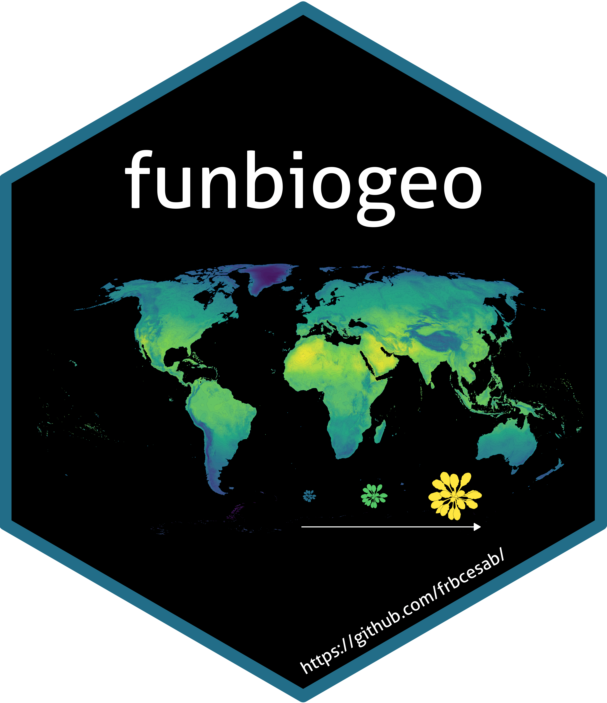

<!-- README.md is generated from README.Rmd. Please edit that file -->

```{r, include = FALSE}
knitr::opts_chunk$set(
  collapse  = TRUE,
  comment   = "#>",
  fig.path  = "man/figures/README-",
  out.width = "100%"
)

pkgload::load_all()
```


# funbiogeo - Streamlining functional biogeography analyses 


<!-- badges: start -->
[](https://github.com/FRBCesab/funbiogeo/actions)
[](https://codecov.io/gh/FRBCesab/funbiogeo)
[](https://CRAN.R-project.org/package=funbiogeo)
[](https://www.gnu.org/licenses/old-licenses/gpl-2.0.en.html)
<!-- badges: end -->

- [Overview](#overview)
- [Features](#features)
- [Installation](#installation)
- [First steps](#first-steps)
- [Long-form documentation (=vignettes)](#long-documentation)
- [Citation](#citation)
- [Contributing](#contributing)
- [Acknowledgments](#acknowledgments)
- [References](#references)


## Overview

The package `funbiogeo` aims to help users with analyses in functional biogeography ([Violle _et al._ 2014](#references)), the biogeography of species' traits, by loading and combining data, computing trait coverage, drawing maps, correlating them with the environment, and upscaling assemblages.
It is aimed at first-timers of functional biogeography as well as more experienced users who want to obtain quick and easy exploratory plots.

Below is a quick introduction to the main features of `funbiogeo`, if you want some more details about them, check [our vignettes](#long-form-documentation).


## Features

`funbiogeo` offers:

* Standardized functions to filter and select your data for further analyses,
* Pleasing default diagnostic plots to visualize the structure of your data,
* Extensive documentation (multiple vignettes, well-documented functions,
  real-life example dataset) to guide you through functional biogeography
  analyses,
* Nice default plotting functions fully compatible with the outputs of functional diversity
  packages (`betapart`, `fundiversity`, `hillR`, `mFD`, etc.),
* Automated standardized report that provide analyses and plots of your data,
* Functions to easily "upscale" your data to coarser spatial resolutions.


## Installation

For the moment `funbiogeo` is not on CRAN but you can install the development 
version from GitHub as follow:

```{r eval=FALSE}
# install.packages("remotes")  # Run this line if 'remotes' pkg is not installed
remotes::install_github("FRBCesab/funbiogeo")
```


## First steps

This section will show you some useful functions from `funbiogeo`. For a longer introduction please refer to the ["Get started" vignette](https://frbcesab.github.io/funbiogeo/).

The package contains default example data named `species_traits`, `site_species`, and `site_locations`. You can for example visualize to completeness of your trait dataset (which traits are known for which proportion of species) using the `fb_plot_species_traits_completeness()` function:

```{r plot-sp-tr-complete}
fb_plot_species_traits_completeness(species_traits)
```

One other useful visualization is to see the trait coverage of each trait across all sites, using the function `fb_map_site_traits_completeness()`:

```{r plot-site-tr-complete}
fb_map_site_traits_completeness(site_locations, site_species, species_traits)
```

See more features of `funbiogeo` in the [vignettes of the package](https://frbcesab.github.io/funbiogeo/articles/)


## Long-form documentation

`funbiogeo` provides four vignettes to explain its functioning:

* A ["Get started" vignette](https://frbcesab.github.io/funbiogeo/articles/funbiogeo.html)
  that describes its core features and guide you through a typical analysis.
* A vignette on [all diagnostic plots](https://frbcesab.github.io/funbiogeo/articles/diagnostic-plots.html)
  provided in the package, which details how to use each plotting function and
  how to interpret their output.
* A vignette on [the data format](https://frbcesab.github.io/funbiogeo/articles/long-format.html)
  that `funbiogeo` needs, which shows you the use of specific functions to format your data to work well within `funbiogeo`.
* A vignette on [data upscaling](https://frbcesab.github.io/funbiogeo/articles/upscaling.html)
  which explains how to leverage `funbiogeo` to aggregate automatically your data to coarser grain and
  use them in further analyses.


## Citation

For the moment `funbiogeo` doesn't offer a companion paper nor is it on CRAN.
But if you happen to use it in your paper you can cite the package through:

> Casajus N & Grenié M (2024). _funbiogeo: Functional Biogeography Analyses_. R package version 0.0.0.9000, <https://github.com/frbcesab/funbiogeo>.

You can also run:

```{r eval=FALSE}
citation("funbiogeo")
```


## Contributing

All types of contributions are encouraged and valued.
For more information, check out our [Contributor Guidelines](https://github.com/FRBCesab/funbiogeo/blob/main/CONTRIBUTING.md).

Please note that the `funbiogeo` project is released with a [Contributor Code of Conduct](https://contributor-covenant.org/version/2/1/CODE_OF_CONDUCT.html). By contributing to this project, you agree to abide by its terms.


## Acknowledgments

This package has been developed for the [FRB-CESAB](https://www.fondationbiodiversite.fr/en/about-the-foundation/le-cesab/) working group [FREE](https://www.fondationbiodiversite.fr/en/the-frb-in-action/programs-and-projects/le-cesab/free/) that aims to advance the concept of functional rarity and examine the causes and consequences of functional rarity from local to global scales.


## References

Violle C, Reich, PB Pacala SW, _et al._ (2014) The emergence and promise of functional biogeography. *Proceedings of the National Academy of Sciences*, **111**, 13690--13696. DOI: [10.1073/pnas.1415442111](https://doi.org/10.1073/pnas.1415442111)
