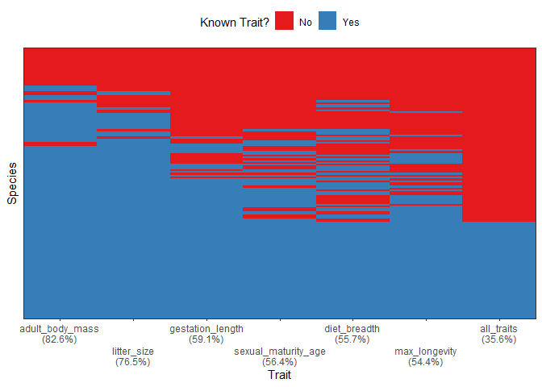

<!-- README.md is generated from README.Rmd. Please edit that file -->

# funbiogeo 

<!-- badges: start -->

[](https://github.com/FRBCesab/funbiogeo/actions)
[](https://codecov.io/gh/FRBCesab/funbiogeo)
[](https://CRAN.R-project.org/package=funbiogeo)
[](https://www.gnu.org/licenses/old-licenses/gpl-2.0.en.html)
[](https://lifecycle.r-lib.org/articles/stages.html#maturing)
[](https://www.repostatus.org/#active)
<!-- badges: end -->

## Overview

The package `funbiogeo` aims to help users with analyses in functional
biogeography (Violle et al. 2014) by loading and combining data,
computing trait coverage, as well as computing functional diversity
indices, drawing maps, correlating them with the environment, and
upscaling assemblages.

It is aimed at first-timers of functional biogeography as well as more
experienced users who want to obtain quick and easy exploratory plots.

## Main Features

`funbiogeo` offers:

- Standardized functions to filter and select your data for further
  analyses,
- Pleasing default diagnostic plots to visualize the structure of your
  data,
- Extensive documentation (multiple vignettes, well-documented
  functions, real-life example dataset) to guide you through functional
  biogeography analyses,
- Nice default plotting functions using outputs from functional
  diversity packages (`betapart`, `fundiversity`, `hillR`, `mFD`, etc.),
- Automated standardized report that provide analyses and plots of your
  data,
- Functions to easily “upscale” your data to coarser spatial
  resolutions.

## Citation

For the moment `funbiogeo` doesn’t offer a companion paper. But if you
happen to use it in your paper you can cite the package through:

> Casajus N, Grenié M (2022). *funbiogeo: Functional Biogeography
> Analyses*. R package version 0.0.0.9000,
> <https://github.com/frbcesab/funbiogeo>.

or the BibTeX version:

    @Manual{,
        title = {funbiogeo: Functional Biogeography Analyses},
        author = {Nicolas Casajus and Matthias Grenié},
        note = {R package version 0.0.0.9000},
        url = {https://github.com/frbcesab/funbiogeo},
      }

## Installation

For the moment `funbiogeo` is not on CRAN but you can install the
development version from GitHub as follow:

``` r
# install.packages("remotes")  # Run this line if 'remotes' pkg is not installed
remotes::install_github("FRBCesab/funbiogeo")
```

## First steps

This section will show you some useful functions from `funbiogeo`. For a
longer introduction please refer to the [“Get started”
vignette](https://frbcesab.github.io/funbiogeo/).

The package contains default example data named `species_traits`,
`site_species`, and `site_locations`. You can for example visualize to
completeness of your trait dataset using the
`fb_plot_species_traits_completeness()` function:

``` r
fb_plot_species_traits_completeness(species_traits)
```



One other useful visualization is to see the trait coverage of each
trait across all sites, using the function
`fb_map_site_traits_completeness()`:

``` r
fb_map_site_traits_completeness(site_locations, site_species, species_traits)
```


See more features of `funbiogeo` in the [vignettes of the
package](https://frbcesab.github.io/funbiogeo/articles/)

## Longer Documentation form

`funbiogeo` provides four vignettes to explain its functioning:

- A [“Get started”
  vignette](https://frbcesab.github.io/funbiogeo/articles/funbiogeo.html)
  that describes its core features and guide you through a typical
  analysis.
- A [vignette on all diagnostic
  plots](https://frbcesab.github.io/funbiogeo/articles/diagnostic-plots.html)
  provided in the package, which details how to use each plotting
  function and how to interpret their output.
- A [vignette on formatting your
  data](https://frbcesab.github.io/funbiogeo/articles/long-format.html)
  to the needs of `funbiogeo`, which shows you the use of specific
  functions.
- And a [specific vignette on
  upscaling](https://frbcesab.github.io/funbiogeo/articles/upscaling.html)
  which explains how to aggregate automatically your data to coarser
  grain and use it in further analyses.

## Code of Conduct

Please note that the `funbiogeo` project is released with a [Contributor
Code of
Conduct](https://contributor-covenant.org/version/2/0/CODE_OF_CONDUCT.html).
By contributing to this project, you agree to abide by its terms.

## References

Violle C, Reich, PB Pacala SW, *et al.* (2014) The emergence and promise
of functional biogeography. *Proceedings of the National Academy of
Sciences*, **111**, 13690–13696. DOI:
[10.1073/pnas.1415442111](https://doi.org/10.1073/pnas.1415442111)
