# Get started with funbiogeo

The aim of the `funbiogeo` package is to help users streamline the
workflows in **fun**ctional **biogeo**graphy (Violle et al. 2014). It
helps filter sites, species, and traits based on their trait coverages.
It also provides default diagnostic plots and standard tables
summarizing input data. This vignette aims to be an introduction to the
most commonly used functions.

This vignette is a worked through real world example of a functional
biogeography workflow using the internal dataset provided in `funbiogeo`
and derived from the WOODIV database (Monnet et al. 2021).

``` r
library("funbiogeo")
library("ggplot2")
library("sf")
#> Linking to GEOS 3.12.1, GDAL 3.8.4, PROJ 9.4.0; sf_use_s2() is TRUE
```

## Types of data

The functions in `funbiogeo` mostly leverage three different objects:

- the **species x traits** `data.frame`, which describes the traits (in
  columns) of the species (in rows) (`species_traits` argument in
  `funbiogeo` functions);
- the **site x species** `data.frame`, which describes the
  presence/absence, the abundance, or the cover of species (in columns)
  across sites (in rows) (`site_species` argument in `funbiogeo`
  functions);
- the **site x locations** object, which describes the physical location
  of sites through an `sf` object (`site_locations` argument in
  `funbiogeo` functions).

*Note: the `site_locations` object must be an `sf` object, as it is now
the standard package for spatial data in R. To have more information
about the sf package, refer to its
[website](https://r-spatial.github.io/sf/articles/sf1.html). If you want
to learn how to convert your data to an `sf` object, check the
[formatting
vignette](https://frbcesab.github.io/funbiogeo/articles/long-format.md).*

Optionally, an additional dataset can be provided:

- the **species x categories** object, which contains a potential
  categorization of species like taxonomic classes, specific diets, or
  any arbitrary classification (`species_categories` argument in
  `funbiogeo` functions)

## Provided dataset

We are interested in mapping the functional traits of 24 Conifer tree
species of Western European Mediterranean regions.

You can load the example data using the
`data(..., package = "funbiogeo")` call:

``` r
data("woodiv_site_species", package = "funbiogeo")
data("woodiv_categories", package = "funbiogeo")
data("woodiv_locations", package = "funbiogeo")
data("woodiv_traits", package = "funbiogeo")
```

In the following sections, we’ll describe in detail these provided
objects in the package.

### Species x Traits

This object contains traits values for multiple traits (as columns) for
studied species (as rows). It should be a `data.frame`. The column
containing species names should be named **“species”** and the other
columns should only contain trait values.

Note that we’ll be talking about **species** throughout this vignette
and in the arguments of `funbiogeo`, but the package doesn’t make any
assumption on the biological level. It can be individuals, populations,
strains, species, genera, families, etc. The important fact is that you
should have trait data for the level at which you want to work. This
biological level should correspond between the trait data
(`species_traits` argument) and the occurrence/abundance (`site_species`
argument) you have.

Let’s examine the `woodiv_traits` data included in the package:

|     | species | plant_height | seed_mass |      sla | wood_density |
|:----|:-------:|-------------:|----------:|---------:|-------------:|
| 1   |  AALB   |     49.64162 |  67.86692 | 7.483978 |    0.4490821 |
| 3   |  ACEP   |     25.87500 |  64.70375 |       NA |           NA |
| 4   |  ANEB   |     15.00000 |        NA | 3.420603 |           NA |
| 5   |  APIN   |     27.33333 |  55.52000 | 3.420603 |    0.4586508 |

Format of species x traits dataset

The first column **`"species"`** contains species names, while the next
four columns contain different traits for all species.

Let’s look at a summary of the trait dataset:

``` r
summary(woodiv_traits)
#>    species           plant_height      seed_mass            sla        
#>  Length:24          Min.   : 1.368   Min.   :  7.608   Min.   : 0.508  
#>  Class :character   1st Qu.: 8.776   1st Qu.: 14.926   1st Qu.: 3.421  
#>  Mode  :character   Median :16.908   Median : 30.188   Median : 4.365  
#>                     Mean   :18.779   Mean   : 62.245   Mean   : 4.773  
#>                     3rd Qu.:25.531   3rd Qu.: 57.558   3rd Qu.: 5.824  
#>                     Max.   :49.642   Max.   :626.189   Max.   :10.600  
#>                                      NA's   :1         NA's   :7       
#>   wood_density   
#>  Min.   :0.2796  
#>  1st Qu.:0.4500  
#>  Median :0.4642  
#>  Mean   :0.4948  
#>  3rd Qu.:0.5300  
#>  Max.   :0.6488  
#>  NA's   :7
```

Note that to use your own species by traits `data.frame`, it should
follow a similar structure with the first column being named
**`"species"`** and the other ones containing traits.

### Site x Species

This object contains species occurrences/abundance/coverage at sites  
of the study area. It is a `data.frame`. The first column, **`"site"`**,
contains site names, while the other columns contain the distribution of
each species across sites.

As mentioned above for the notion of “species” we’re referring to, we
are talking about sites in an abstract way. `funbiogeo` doesn’t have a
specific notion of sites, but these can be any groupings of individuals
whatever the scale. These could, for example, be plots, assemblages,
countries, or biomes.

The package `funbiogeo` comes with the example dataset on Conifer tree
species of Western European Mediterranean regions `woodiv_site_species`.
Let’s look at it:

|   site   | AALB | ACEP | APIN | CLIB | CSEM |
|:--------:|:----:|:----:|:----:|:----:|:----:|
| 41152325 |  1   |  0   |  0   |  0   |  0   |
| 40852325 |  1   |  0   |  0   |  0   |  0   |
| 40852345 |  1   |  0   |  0   |  0   |  0   |
| 42552105 |  1   |  0   |  0   |  0   |  0   |
| 41152315 |  1   |  0   |  0   |  0   |  0   |
| 37452365 |  1   |  0   |  0   |  0   |  0   |
| 36952225 |  1   |  0   |  0   |  0   |  0   |
| 37152185 |  1   |  0   |  0   |  0   |  0   |
| 39852335 |  1   |  0   |  0   |  0   |  0   |
| 39652375 |  1   |  0   |  0   |  0   |  0   |

Format of site x species dataset

The example dataset contains the occurrence of the 24 Conifer tree
species across 5,366 sites (grid cells of 10 km x 10 km resolution).

To use your own site by species `data.frame`, you should follow a
similar structure with the first column being named **`"site"`** and the
other ones containing presence information of species across sites.

### Site x Locations

This object contains the geographical location of the sites. It should
be an `sf` object from the [`sf`
package](https://cran.r-project.org/package=sf). These are spatial R
objects that describe geographical locations. The sites can have
arbitrary shapes: points, regular polygons, irregular polygons, or even
line transects! To make sure that your data is well plotted you should
specify the Coordinate Reference System (CRS) of this object.

The package `funbiogeo` comes with the example dataset
`woodiv_locations` defining the location of the 5,366 sites (grid cells
of 10 km x 10 km resolution) as polygons. It contains the label of the
sites in its first column **`"site"`**:

``` r
head(woodiv_locations)
#> Simple feature collection with 6 features and 2 fields
#> Geometry type: POLYGON
#> Dimension:     XY
#> Bounding box:  xmin: 2630000 ymin: 1750000 xmax: 2650000 ymax: 1970000
#> Projected CRS: ETRS89-extended / LAEA Europe
#>       site  country                       geometry
#> 1 26351755 Portugal POLYGON ((2630000 1750000, ...
#> 2 26351765 Portugal POLYGON ((2630000 1760000, ...
#> 4 26351955 Portugal POLYGON ((2630000 1950000, ...
#> 5 26351965 Portugal POLYGON ((2630000 1960000, ...
#> 6 26451755 Portugal POLYGON ((2640000 1750000, ...
#> 7 26451765 Portugal POLYGON ((2640000 1760000, ...
```

Note that to use your own site locations object, it should follow a
similar structure, being an `sf` object with the first column being
named **`"site"`**.

### Species x Categories

This optional object contains a categorization of species like taxonomic
classes, specific diets, or any arbitrary classification
(`species_categories` argument in some `funbiogeo` functions). It must
contain only two columns: the **`species`** column and the category of
species.

The package `funbiogeo` comes with the example dataset
`woodiv_categories` providing different species categorizations: the
species family, the species genus, the species endemism, and the
cultivated status of the species.

Let’s have a look at this dataset:

| species |  family  | genus  | binomial          | endemism | cultivated |
|:-------:|:--------:|:------:|:------------------|:--------:|:----------:|
|  AALB   | Pinaceae | Abies  | Abies alba        |    0     |     0      |
|  ACEP   | Pinaceae | Abies  | Abies cephalonica |    1     |     0      |
|  ANEB   | Pinaceae | Abies  | Abies nebrodensis |    1     |     0      |
|  APIN   | Pinaceae | Abies  | Abies pinsapo     |    1     |     0      |
|  CLIB   | Pinaceae | Cedrus | Cedrus libani     |    0     |     1      |

Format of species x categories dataset

Let’s select the **`family`** category:

    #>   species       family
    #> 1    AALB     Pinaceae
    #> 3    ACEP     Pinaceae
    #> 4    ANEB     Pinaceae
    #> 5    APIN     Pinaceae
    #> 6    CLIB     Pinaceae
    #> 7    CSEM Cupressaceae

## Visualizing the data (diagnostic plots)

`funbiogeo` provides many functions to display the data to help the user
select specific traits, species, and/or sites. We are going to detail
some of them in this section (see the full list and how to interpret
them in the [diagnostic plot
vignette](https://frbcesab.github.io/funbiogeo/articles/diagnostic-plots.Rmd)).
We call them *diagnostic plots* because they help us to have an overview
of our dataset **prior** to the analyses.

### Trait completeness per species

A first way to visualize our `data.frame` is to look at the proportion
of species with non-missing traits using the
[`fb_plot_number_species_by_trait()`](https://frbcesab.github.io/funbiogeo/reference/fb_plot_number_species_by_trait.md)
function. It takes the species by trait `data.frame` as input.

``` r
fb_plot_number_species_by_trait(woodiv_traits)
```

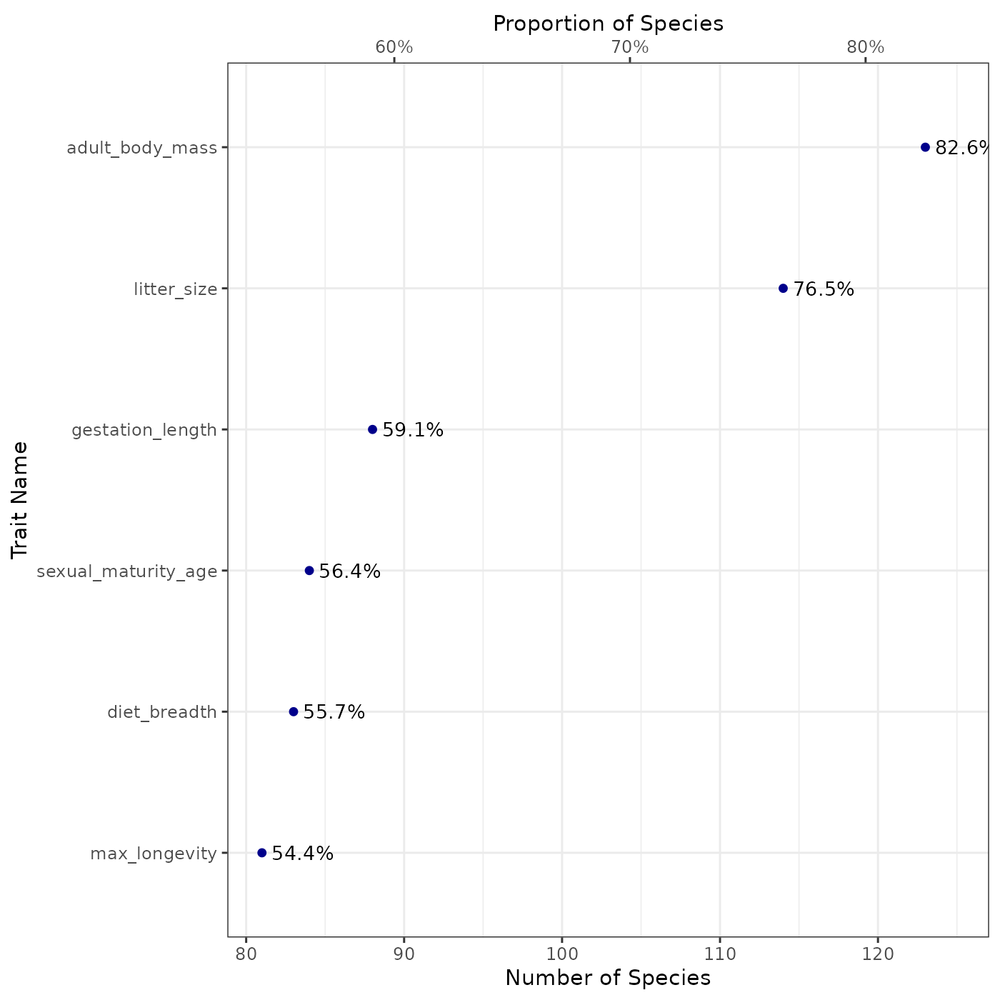

This plot shows us the number of species (along the x-axis) in function
of the trait name (along the y-axis). The number of concerned species is
shown at the bottom of the plot while the corresponding proportion of
species (compared to all the species included in the trait dataset) is
indicated as a secondary x-axis at the top. The proportion of species
concerned is shown at the right of each point. For example, in our
example dataset, 70.8% species have a value for SLA.

The function also includes a way to provide a target proportion of
species as the second argument. It will display the proportion as a dark
red dashed line.

For example, if we want to visualize which traits are available for more
than 75% of the species (we can also say which traits *cover* more than
75% of the species), we can use function
[`fb_plot_number_species_by_trait()`](https://frbcesab.github.io/funbiogeo/reference/fb_plot_number_species_by_trait.md).
It takes as first argument, the species by traits table, then, as second
argument the proportion of species to consider (as a number between 0
and 1):

``` r
fb_plot_number_species_by_trait(
  woodiv_traits, threshold_species_proportion = 0.75
)
```

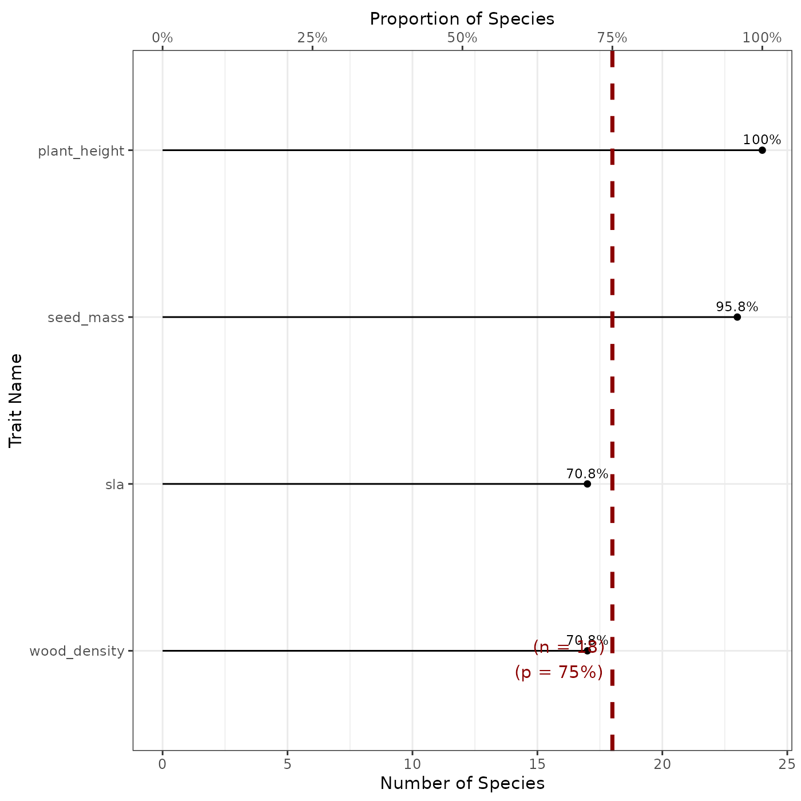

The plot shows us the number (and proportion) of species which have
non-missing values for each trait included in our dataset. The number of
species is specified as the bottom x-axis, while its corresponding
proportion is reported as the top x-axis. According to this graph, we
see that plant height is available for 100% of species, while SLA is
only available for 70.8% of the species in the dataset. The dashed red
line represents the proportion we gave as threshold in the function call
above. By the line we see this proportion (75%) with the corresponding
species number (18) as labels on the plot. Given this plot, we know that
only two traits are available for more than 75% of the species: plant
height and seed mass.

### Number of Traits per Species

Another way to filter the data would be to select certain species that
have at least a certain number of traits. This can be visualized using
the
[`fb_plot_number_traits_by_species()`](https://frbcesab.github.io/funbiogeo/reference/fb_plot_number_traits_by_species.md)
function. Similarly to the above-mentioned function, it takes the
species x traits `data.frame` as the first argument:

``` r
fb_plot_number_traits_by_species(woodiv_traits)
```

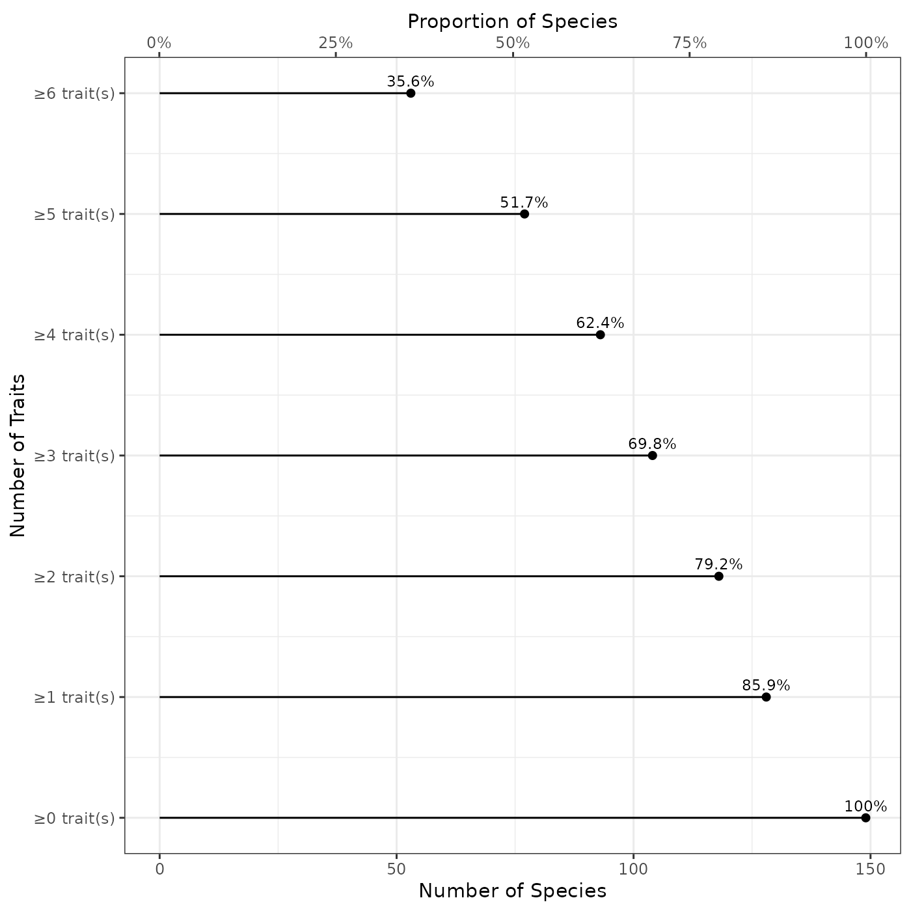

The plot shows the number (bottom x-axis) and the proportion (top
x-axis) of species covered by a specific number of traits (0 to 4 in our
example). We can read it as the fact that 58.3% of the species show
non-missing values for the four traits in the dataset. However, all
species (100%) have non-missing values for two or more traits. This
doesn’t mean that these two traits are the same, but that all species of
datasets have non-missing values for a combination two traits among the
four provided traits.

To identify further which combinations of traits are most frequently
available together, we can use the
[`fb_plot_trait_combination_frequencies()`](https://frbcesab.github.io/funbiogeo/reference/fb_plot_trait_combination_frequencies.md)
function. This function takes the species-traits table as first
argument:

``` r
fb_plot_trait_combination_frequencies(woodiv_traits)
```

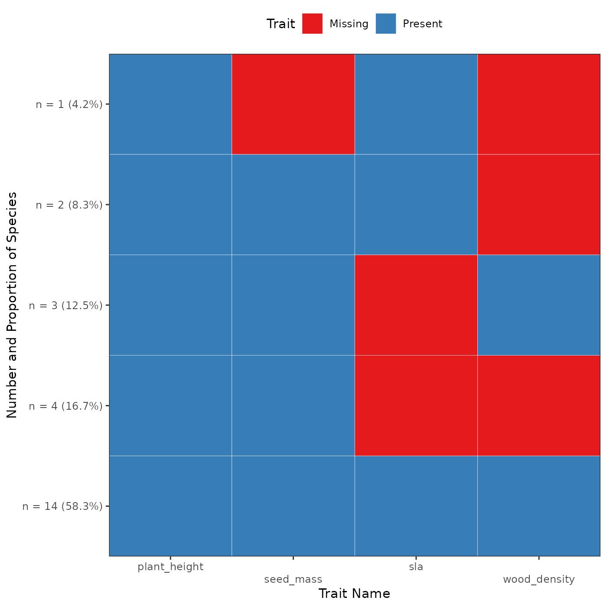

In this plot, each **observed** combination of missing and non-missing
trait is represented as a row. Each column represents a different trait.
The y-axis details how many species (as well as the corresponding
proportion) harvest this particular combination of missing/non-missing
trait values. The cells are blue to represent non-missing trait, and red
when they are missing. At the bottom of the graph, we can indeed see
that 14 species (representing 58.3% of the species), have all traits
that are non-missing. At the very top we see that only one species has
the a non-missing plant height and SLA with a missing seed mass and wood
density. This graph allows us to better examine the missingness patterns
among our trait dataset. To see all the available options in `funbiogeo`
as well as the details of the arguments of each function refer to the
[diagnostic plots
vignette](https://frbcesab.github.io/funbiogeo/articles/diagnostic-plots.md).

## Filtering the data

We performed simple visualizations of our dataset to know identify our
patterns of trait completeness. Based on these plots, we can choose
thresholds in trait completeness to filter our data for our following
analyses.

### Filter trait by species coverage

We want to select the traits that are available for at least 75% of the
species. To do so we can use the
[`fb_filter_traits_by_species_coverage()`](https://frbcesab.github.io/funbiogeo/reference/fb_filter_traits_by_species_coverage.md)
function. The function takes the species by traits `data.frame` and
outputs the same dataset but with the traits filtered (so with fewer
columns). The second argument `threshold_species_proportion` is the
threshold proportion of species covered:

``` r
# Initial dimension of the input data
dim(woodiv_traits)
#> [1] 24  5

# Filter traits 
selected_traits <- fb_filter_traits_by_species_coverage(
  woodiv_traits, threshold_species_proportion =  0.75
)

dim(selected_traits)
#> [1] 24  3

# The reduced data set now has fewer trait columns
head(selected_traits)
#>   species plant_height seed_mass
#> 1    AALB     49.64162 67.866923
#> 3    ACEP     25.87500 64.703750
#> 4    ANEB     15.00000        NA
#> 5    APIN     27.33333 55.520000
#> 6    CLIB     35.63636 86.872600
#> 7    CSEM     24.69231  7.608125
```

The function outputs a filtered species-traits dataset retaining only
traits covering at least 75% of the species. In the end, this keep only
two traits: plant height and seed mass.

### Filter species by trait coverage

Now that we obtained a reduced trait dataset, selecting only two traits,
this doesn’t mean that these traits are available for all species. We
could filter species that have only non-missing traits through the
function
[`fb_filter_species_by_trait_coverage()`](https://frbcesab.github.io/funbiogeo/reference/fb_filter_species_by_trait_coverage.md)
with the species x traits `data.frame` as the first argument and the
second argument the proportion of traits that should be known by
species. Here, because we want the species to have all the traits our
threshold will be 100%. This way we can filter our dataset again:

``` r
# Filter species which have at least 100% of known traits
selected_species <- fb_filter_species_by_trait_coverage(
  selected_traits, threshold_traits_proportion = 1
)

dim(selected_species)
#> [1] 23  3

head(selected_species)
#>   species plant_height seed_mass
#> 1    AALB    49.641622 67.866923
#> 3    ACEP    25.875000 64.703750
#> 5    APIN    27.333333 55.520000
#> 6    CLIB    35.636364 86.872600
#> 7    CSEM    24.692308  7.608125
#> 8    JCOM     6.894711 14.556875
```

In the end, by filtering the traits available for at least 75% of the
species, have filtering the species that have only non-missing traits
for these traits, we ended with a list of 23 species and 2 traits. This
is the dataset we’ll continue using in the rest of the vignette.

### Filter sites by trait coverage

Now that we have filtered our traits and species of interest, we need to
filter the sites that contain enough species for which the traits are
available. Similarly to above the function is
[`fb_filter_sites_by_trait_coverage()`](https://frbcesab.github.io/funbiogeo/reference/fb_filter_sites_by_trait_coverage.md)
it takes as first two arguments the site x species `data.frame` and the
species x traits `data.frame`. The third argument is
`threshold_traits_proportion` that indicates the percent coverage of
traits to filter each site. Note that this coverage is weighted by the
occurrence, abundance, or cover depending on the content of the site x
species `data.frame`.

Let’s say here we’re interested in sites for which our species with
available traits represent at least 90% of the species present:

``` r
# Initial site x species data
dim(woodiv_site_species)
#> [1] 5366   25

# Filter sites with at least 90% species covered
filt_sites <- fb_filter_sites_by_trait_coverage(
  woodiv_site_species, selected_species, threshold_traits_proportion = 0.9
)

# Filtered sites
dim(filt_sites)
#> [1] 5364   25

filt_sites[1:4, 1:4]
#>       site AALB ACEP APIN
#> 1 41152325    1    0    0
#> 2 40852325    1    0    0
#> 3 40852345    1    0    0
#> 4 42552105    1    0    0
```

The output of the function is a site x species `data.frame` with
selected sites and species. Now we selected 5,364 sites out of 5,366,
for our 2 traits and 23 species.

## Computing Functional Diversity metrics

The `funbiogeo` functions helped us filter our data appropriately with
enough available trait information for species and sites. The goal of
`funbiogeo` is to help you analyzing functional trait data and computing
functional diversity indices. These indices capture the diversity of
trait values in a set of species, if you’re interested in an
introduction to functional diversity indices and how to analyze them,
it’s out of scope of this vignette, but you can refer to Mammola et al.
(2021). The paper provides a general workflow to work with trait data.

`funbiogeo` doesn’t aim to substitute to all these amazing tools that
compute a diversity of indices with different properties and formulas.,
however, we can use the filtered datasets to proceed with our analyses
This is where you should use your preferred packages to compute
functional diversity indices like
[`mFD`](https://cran.r-project.org/package=mFD) or
[`funrar`](https://cran.r-project.org/package=funrar). If you’re new to
the world of functional diversity analyses, we suggest reading [`mFD`
introductory
vignette](https://cmlmagneville.github.io/mFD/articles/mFD_general_workflow.html).
It underlines the different steps to compute functional diversity
metrics. If you’re interested in computing functional rarity indices
with `funrar` you canalso refer to [its
tutorial](https://rekyt.github.io/funrar/articles/funrar.html).

For the sake of the example, we included a function in `funbiogeo` to
compute Community-Weighted Mean (CWM, Garnier et al. 2004) named
[`fb_cwm()`](https://frbcesab.github.io/funbiogeo/reference/fb_cwm.md).
The CWM is the abundance-weighted average trait per site. We’ll be using
it in the following section, then we’ll then show another example
computing functional diversity indices using the `mFD` package.

### Community-Weighted Mean (CWM)

We’re interested to look at the spatial distribution of the average
plant height and seed mass of Conifer tree species. To do so, we can
compute the community-weighted mean of both traits. We’ll use the
[`fb_cwm()`](https://frbcesab.github.io/funbiogeo/reference/fb_cwm.md)
function to do so, it takes the site x species `data.frame` and species
x traits `data.frame` as arguments.

``` r
# We're reusing our filtered data, on both the site x species data.frame
# and the species x traits data.frame to compute CWM
cwm <- fb_cwm(filt_sites, selected_species)

head(cwm)
#>       site        trait      cwm
#> 1 26351755 plant_height 12.31767
#> 2 26351765 plant_height  4.88150
#> 3 26351955 plant_height 12.31767
#> 4 26351965 plant_height 13.77575
#> 5 26451755 plant_height  4.88150
#> 6 26451765 plant_height 15.76845
```

It outputs a `data.frame` with 3 columns: the first one, `site`, shows
the site name as provided in the input site x species `data.frame`,
`trait` which indicates the trait name on which the CWM is computed, and
`cwm` which shows the value of the CWM at this site for this trait.

### Compute functional diversity indices

We can also integrate our filtered datasets in other functional
diversity computation pipeline. We’ll show an example by computing
functional richness with the `mFD` package.

Before computing any functional diversity index, we need to scale and
center our trait values so that they are on comparable scales. For this
we can use the `tr.cont.scale()` function in `mFD`. The function
requires that species names are available as row names instead of having
a separate `species` column. We first give row names and then use the
function to scale our traits.

*Note: the following chunk of code is executed only if you have `mFD`
installed*

``` r
## To install 'mFD' uncomment the following line
# install.packages("mFD")

# Create a new object
subset_traits <- selected_species

# Add row names
rownames(subset_traits) <- subset_traits[["species"]]

# Remove unused 'species' column
subset_traits <- subset_traits[, -1]

# Scale traits
scaled_traits <- mFD::tr.cont.scale(subset_traits)

# Check that traits are scaled (should have a mean of 0 and SD of 1)
summary(scaled_traits)
#>   plant_height       seed_mass       
#>  Min.   :-1.4651   Min.   :-0.43558  
#>  1st Qu.:-0.8662   1st Qu.:-0.37724  
#>  Median :-0.1174   Median :-0.25557  
#>  Mean   : 0.0000   Mean   : 0.00000  
#>  3rd Qu.: 0.5587   3rd Qu.:-0.03737  
#>  Max.   : 2.5591   Max.   : 4.49587

# Compare initial trait data to scaled traits
head(selected_species)
#>   species plant_height seed_mass
#> 1    AALB    49.641622 67.866923
#> 3    ACEP    25.875000 64.703750
#> 5    APIN    27.333333 55.520000
#> 6    CLIB    35.636364 86.872600
#> 7    CSEM    24.692308  7.608125
#> 8    JCOM     6.894711 14.556875
head(scaled_traits)
#>      plant_height   seed_mass
#> AALB    2.5590553  0.04481508
#> ACEP    0.5778367  0.01959764
#> APIN    0.6994054 -0.05361705
#> CLIB    1.3915576  0.19633213
#> CSEM    0.4792459 -0.43558008
#> JCOM   -1.0043865 -0.38018325
```

We get a data.frame with the two scaled traits and species names as row
names.

To compute functional diversity indices with `mFD` we further need a
site by species data.frame, with sites names as row names, and only for
the species for which we have the traits in the species by trait table.
We thus transform the site by species object:

``` r
# Copy filtered sites
formatted_site_species <- filt_sites

# Put site names as row names
rownames(formatted_site_species) <- filt_sites[["site"]]
formatted_site_species <- formatted_site_species[, -1]

# Keeping only species for which we have the traits
formatted_site_species <- formatted_site_species[, rownames(scaled_traits)]

formatted_site_species[1:5, 1:5]
#>          AALB ACEP APIN CLIB CSEM
#> 41152325    1    0    0    0    0
#> 40852325    1    0    0    0    0
#> 40852345    1    0    0    0    0
#> 42552105    1    0    0    0    0
#> 41152315    1    0    0    0    0
```

`mFD` furthermore requires that the site by species object is a
`matrix`, we thus convert it to a matrix:

``` r
formatted_site_species <- as.matrix(formatted_site_species)
```

We can now compute functional diversity metrics using the
`alpha.fd.multidim()` function from the `mFD` package. We’ll be using
our two formatted objects `scaled_traits` as our species by trait table,
and `formatted_site_species` as our site by species table. We’ll be
computing Functional Dispersion (noted FDis) as a functional diversity
index. It’s out of the scope of this vignette to explain the differences
between functional diversity indices, but we recommend reading Mammola
et al. (2021) for a general introduction about them.

Going back to computing Functional Dispersion with the
`alpha.fd.multidim()` function, we need to use the species-traits table
as first argument then the site-species table as second argument, then
the name of the functional diversity index as a third argument:

``` r
woodiv_fdis <- mFD::alpha.fd.multidim(
  scaled_traits, formatted_site_species, ind_vect = "fdis",
  # remove all of the messages
  details_returned = FALSE, verbose = FALSE
)

head(woodiv_fdis$functional_diversity_indices)
#>          sp_richn      fdis fide_plant_height fide_seed_mass
#> 41152325        7 0.3847528       -0.14087355     -0.1624503
#> 40852325        8 0.4080783        0.09301692     -0.1733643
#> 40852345        8 0.4213861        0.04003436     -0.2076613
#> 42552105        6 0.4368759        0.26890829     -0.1355701
#> 41152315        9 0.3917271        0.01446366     -0.1938831
#> 37452365        2 0.6982520        0.77733440     -0.1676841
```

We now have a table with several diversity indices computed for each
site. This table contains site names as row names an four columns:

- `sp_richn`, which is the species richness,
- `fdis`, the Functional Dispersion index,
- `fide_plant_height`, the average plant height of all species of the
  site,
- `fide_seed_mass`, the average seed mass of all species of the site.

Now, we can use `funbiogeo` again to put these different indices on a
map to better understand our dataset. Mapping functions are the topic of
the next section of this introductory vignette.

## Putting variables on the map

### Mapping diversity indices

As we’re interested in putting functional dispersion on a map, we should
slightly transform our site-indices table to include an explicit `site`
column as required by `funbiogeo`:

``` r
# Simplify object
woodiv_fdis <- woodiv_fdis$functional_diversity_indices

# Create 'site' column
woodiv_fdis[["site"]] <- rownames(woodiv_fdis)

# Remove row names
rownames(woodiv_fdis) <- NULL

# Move 'site' column as first column
woodiv_fdis <- woodiv_fdis[, c(5, 1:4)]

head(woodiv_fdis)
#>       site sp_richn      fdis fide_plant_height fide_seed_mass
#> 1 41152325        7 0.3847528       -0.14087355     -0.1624503
#> 2 40852325        8 0.4080783        0.09301692     -0.1733643
#> 3 40852345        8 0.4213861        0.04003436     -0.2076613
#> 4 42552105        6 0.4368759        0.26890829     -0.1355701
#> 5 41152315        9 0.3917271        0.01446366     -0.1938831
#> 6 37452365        2 0.6982520        0.77733440     -0.1676841
```

We get a regular data.frame describing each diversity index with the
`site` column giving the id of the sites. Using `funbiogeo` we can
automatically create a map of these variables by using the
[`fb_map_site_data()`](https://frbcesab.github.io/funbiogeo/reference/fb_map_site_data.md)
function. It takes as first three arguments: (1) the site locations `sf`
object, (2) the data.frame containing the data to be plotted with a
column named `site`, (3) the name of the column to be plotted on the map
as a character string (= quoted). Let’s represent the functional
dispersion:

``` r
fb_map_site_data(woodiv_locations, woodiv_fdis, "fdis")
```

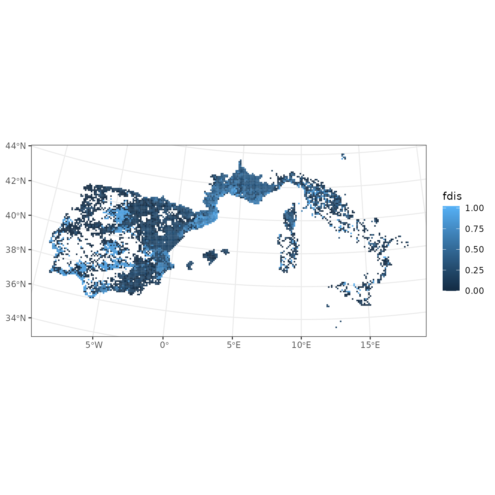 We get a map of our
sites, colored by Functional Dispersion. The map uses the default
`ggplot2` color scheme. We see that we have higher functional dispersion
in Spain and in the French-Spanish border than in Italy. Because all of
the plotting functions of `funbiogeo` output `ggplot2` objects they can
be customized using usual `ggplot2` syntax:

``` r
fb_map_site_data(woodiv_locations, woodiv_fdis, "fdis") +
  scale_fill_viridis_c() +
  labs(fill = "Functional Dispersion",
       title = "WOODIV (2 traits: plant height & seed mass)") +
  theme(legend.position = "bottom")
```

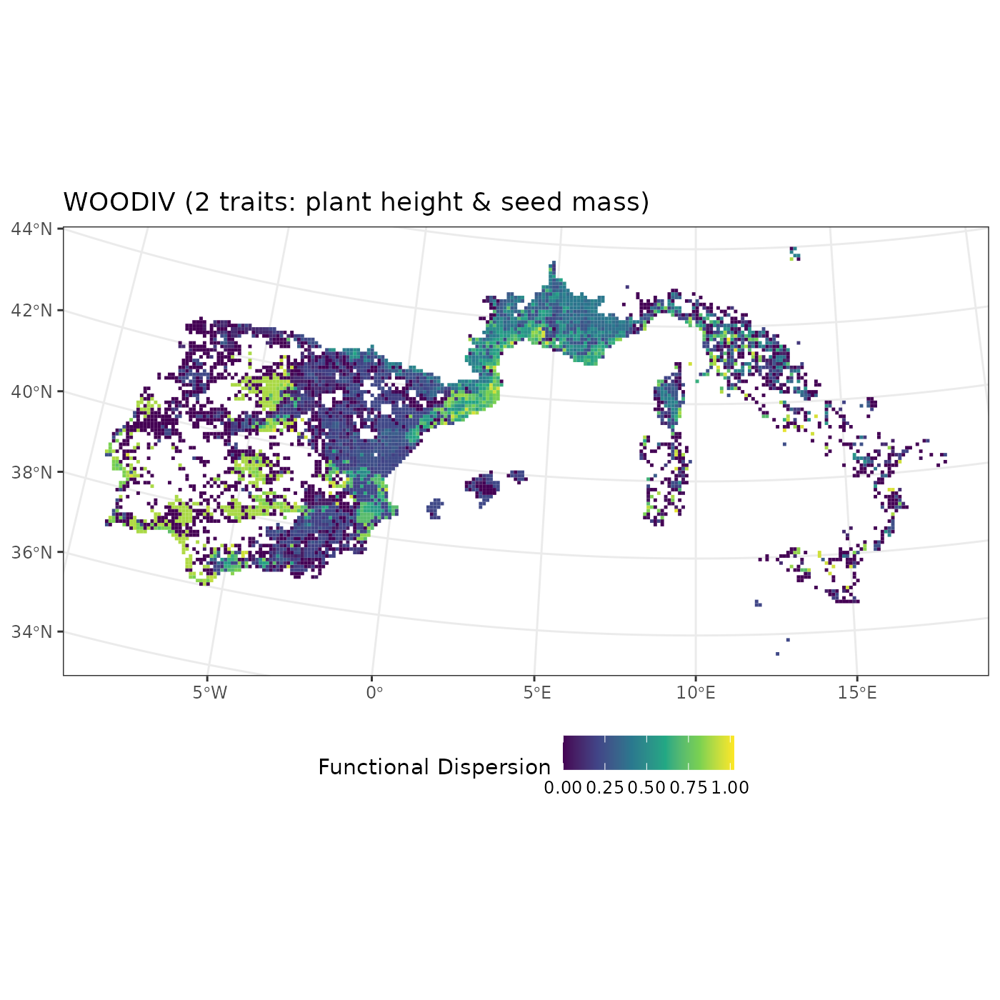

We can proceed similarly to display the average plant height per
assemblage by specifying the name of the column `fide_plant_height` from
our `woodiv_fdis` data.frame:

``` r
fb_map_site_data(woodiv_locations, woodiv_fdis, "fide_plant_height") +
  # Additional code to customize our plot
  scale_fill_distiller("Average plant height", palette = "RdYlBu") +
  labs(title = "WOODIV average plant height") +
  theme(legend.position = "bottom")
```

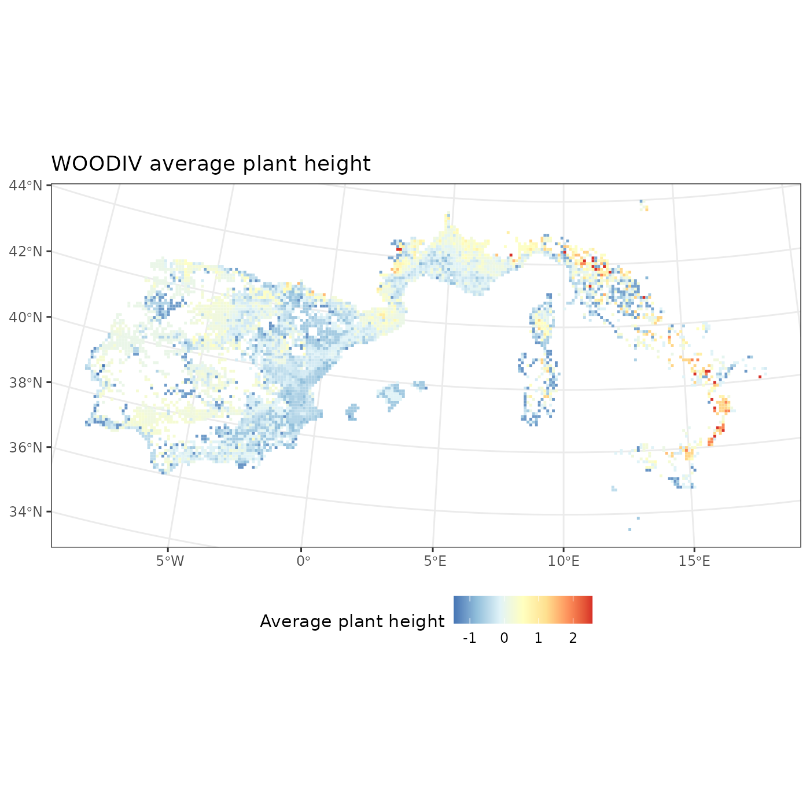

We see that the tallest assemblages are in Italy, while central Spain
and North of Portugal shows the lowest average plant height. You can
adapt the above code on the other available diversity indices.

### Mapping an environmental raster

A common case of analysis in biogeography is to be interested in mapping
environmental variables. If we want to display the environment
associated with our sites of interest, we can leverage environmental
raster layers as provided, for example, by WorldClim (Fick and Hijmans
2017) or CHELSA (Karger et al. 2017). Fortunately, we have access to an
example raster of mean annual temperature through `funbiogeo`.

We ar first going to read the raster using the `terra` package, which is
the reference package to read spatial raster data. If you want to know
more about raster data, we recommend reading the [dedicated
chapter](https://r.geocompx.org/raster) in the [*Geocomputations with
R*](https://r.geocompx.org/) book (Lovelace, Nowosad, and Muenchow
2025). Then, we’ll use the
[`fb_map_raster()`](https://frbcesab.github.io/funbiogeo/reference/fb_map_raster.md)
function that displays a map for the first layer of the raster data. It
takes the actual raster object as first argument. The other arguments
are passed to the
[`theme()`](https://ggplot2.tidyverse.org/reference/theme.html) function
of ggplot2 to customize the plot.

So first, let’s read the mean annual temperature raster provided by
`funbiogeo`. For this, we’ll use the
[`system.file()`](https://rdrr.io/r/base/system.file.html) function
which allows accessing specific files from packages, then we’ll read the
raster with the `rast()` function from the `terra` package:

``` r
# Get file pathr
tavg <- system.file(
  "extdata", "annual_mean_temp.tif", package = "funbiogeo"
)

# Read raster
tavg <- terra::rast(tavg)

# Display object
tavg
#> class       : SpatRaster 
#> size        : 290, 405, 1  (nrow, ncol, nlyr)
#> resolution  : 0.08333333, 0.08333333  (x, y)
#> extent      : -10.5, 23.25, 35.83333, 60  (xmin, xmax, ymin, ymax)
#> coord. ref. : lon/lat WGS 84 (EPSG:4326) 
#> source      : annual_mean_temp.tif 
#> name        : annual_mean_temp 
#> min value   :        -5.921834 
#> max value   :        19.843750
```

This raster represents mean annual temperature in Europe. We can see
that the temperature goes between -5.9°C and 19.8°C. The raster isn’t
projected (as given by its
[EPSG](https://en.wikipedia.org/wiki/EPSG_Geodetic_Parameter_Dataset)
code).

We then display it with the
[`fb_map_raster()`](https://frbcesab.github.io/funbiogeo/reference/fb_map_raster.md)
function from `funbiogeo` in the next chunk.

``` r
# Map raster
fb_map_raster(tavg)
```

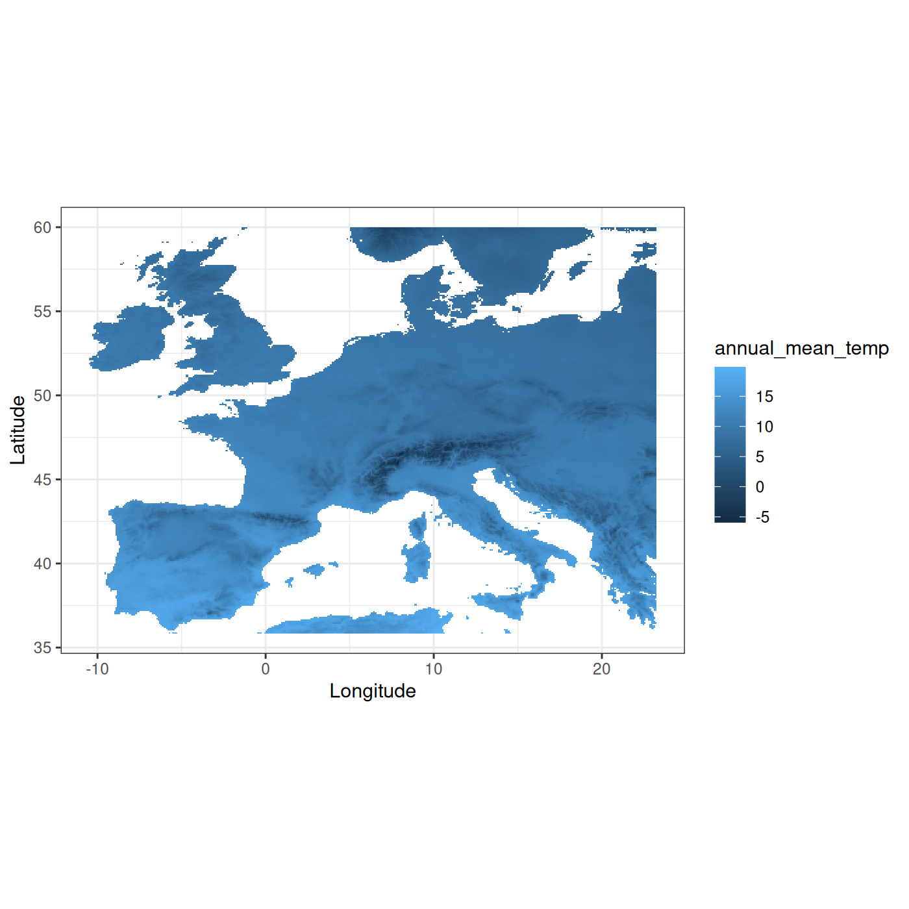

As with all plots provided by `funbiogeo`, the
[`fb_map_raster()`](https://frbcesab.github.io/funbiogeo/reference/fb_map_raster.md)
returns a ggplot2 object which can be customized providing additional
functions:

``` r
# Map raster
fb_map_raster(tavg) + 
  scale_fill_distiller("Temperature", palette = "Spectral") +
  labs(title = "Mean annual temperature in Europe") +
  theme(legend.position = "bottom")
```

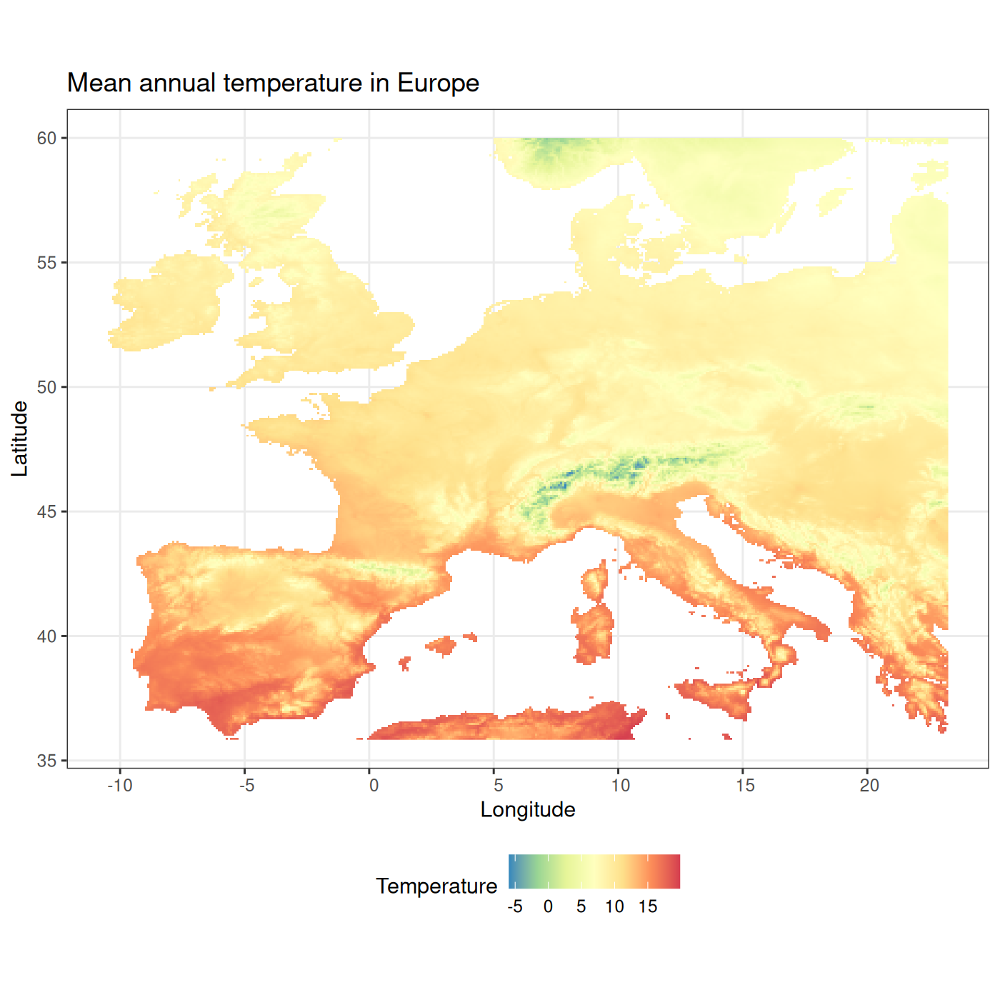

To learn about the ggplot2 syntax and functions check the [`ggplot2`
introductory
vignette](https://ggplot2.tidyverse.org/articles/ggplot2.html).

Leveraging the `patchwork` package, that allows to combine different
`ggplot2` objects, we can have side-by-side, the map of mean annual
temperature and the one on annual total precipitation:

``` r
library("patchwork")

# Read rasters
tavg <- system.file("extdata", "annual_mean_temp.tif", package = "funbiogeo")
tavg <- terra::rast(tavg)

prec <- system.file("extdata", "annual_tot_prec.tif", package = "funbiogeo")
prec <- terra::rast(prec)

# Individual Maps
map_temperature <- fb_map_raster(tavg, legend.position = "none") + 
  scale_fill_distiller("Temperature", palette = "Spectral")

map_precipitation <- fb_map_raster(prec) + 
  scale_fill_distiller("Precipitation", direction = 1)

# Compose plot (leveraging `patchwork`)
(map_temperature / map_precipitation) + 
  plot_annotation(title = "Europe", 
                  theme = theme(plot.title = element_text(face = "bold"))) & 
  theme_classic() &
  theme(text = element_text(family = "mono"))
```

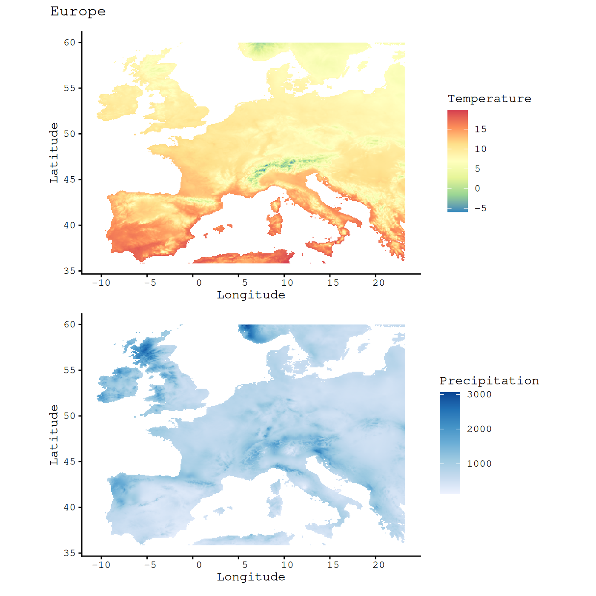

This function allows the visualization of a raster in a simple fashion,
but it doesn’t tell us anything about the environmental variable at the
sites we’re interested in. In the next section we will map an
environmental variable at each site of our study.

### Map of average environmental variable in site

We want to make a map of the average environmental conditions of the
sites. For this we’re using the above-mentioned `terra` raster of the
mean annual temperature, named `tavg`. To automatically extract the
average mean annual temperature per site, we use the
[`fb_get_environment()`](https://frbcesab.github.io/funbiogeo/reference/fb_get_environment.md)
function, it takes as first argumen the site-locations object and a
second argument the environmental raster. It takes the average of the
raster values per site.

``` r
site_env <- fb_get_environment(woodiv_locations, tavg)

head(site_env)
#>       site annual_mean_temp
#> 1 26351755              NaN
#> 2 26351765         16.44746
#> 3 26351955         16.08605
#> 4 26351965              NaN
#> 5 26451755         16.66498
#> 6 26451765         16.39656
```

The variable names in the columns are based on the names of the provided
raster. Here, because the raster has a single layer named
`annual_mean_temp`, it’s the name of the column. Note that the
[`fb_get_environment()`](https://frbcesab.github.io/funbiogeo/reference/fb_get_environment.md)
function also works with multi-layered rasters to extract multiple
average conditions at observed sites.

To put these values on the map we can use the
[`fb_map_site_data()`](https://frbcesab.github.io/funbiogeo/reference/fb_map_site_data.md)
function, which allows mapping arbitrary site-level variables. It takes
three needed arguments: the first of which, `site_locations`, which is
the `sf` object describing sites’ geographic locations; the second
argument is `site_data`, which is a `data.frame` giving additional data
indexed by site; and `selected_col`, which is a character giving the
name of the column to plot from the `site_data` argument.

We can thus plot the mean annual temperature of sites through the
following commands:

``` r
fb_map_site_data(woodiv_locations, site_env, "annual_mean_temp") +
  labs(title = "Mean Annual Temperature per Site")
```

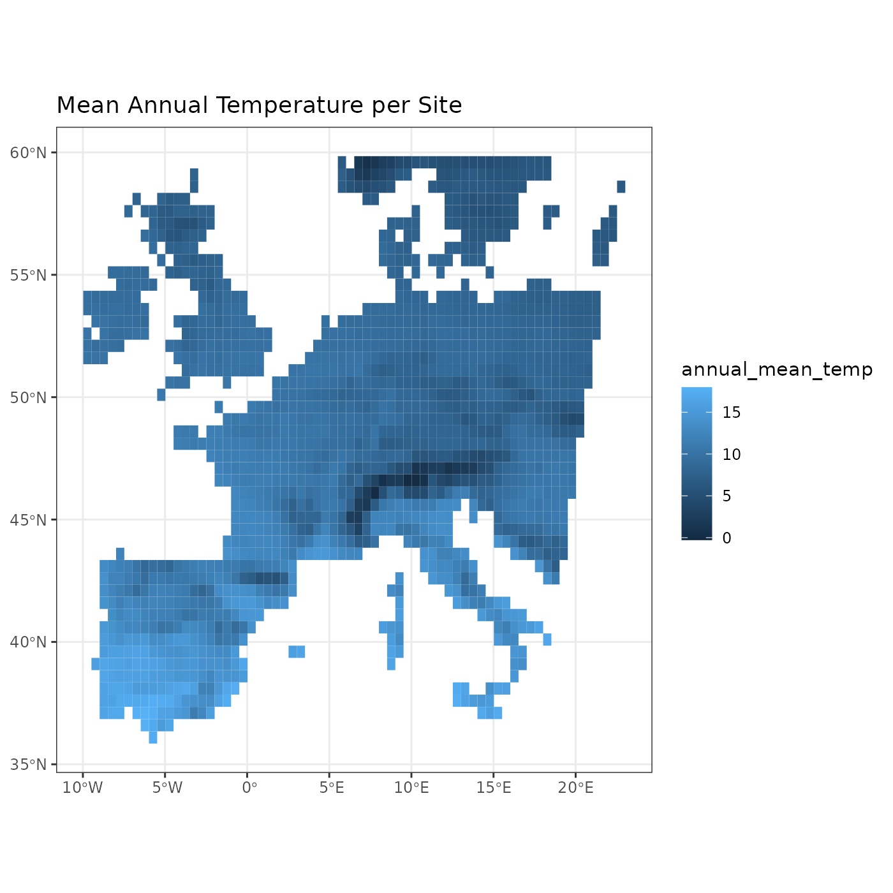

## Conclusion

This concludes our tutorial to introduce `funbiogeo`. The package
contains many more features, especially several diagnostic plots that
allow to identify which trait are missing or not, at species or site
scales. All of the plots are explained in details in [a dedicated
vignette](https://frbcesab.github.io/funbiogeo/articles/diagnostic-plots.Rmd).
There is also a specific vignette about [transforming raw data from long
to wide
format](https://frbcesab.github.io/funbiogeo/articles/long-format.Rmd).
Finally, if you’re interested in learning about up-scaling your sites,
which means aggregating your sites at coarser scales,you can refer to
[the specific
vignette](https://frbcesab.github.io/funbiogeo/articles/upscaling.Rmd).

## References

Fick, Stephen E., and Robert J. Hijmans. 2017. “WorldClim 2: New 1-Km
Spatial Resolution Climate Surfaces for Global Land Areas.”
*International Journal of Climatology* 37 (12): 4302–15.
<https://doi.org/10.1002/joc.5086>.

Garnier, Eric, Jacques Cortez, Georges Billès, Marie-Laure Navas,
Catherine Roumet, Max Debussche, Gérard Laurent, et al. 2004. “Plant
Functional Markers Capture Ecosystem Properties During Secondary
Succession.” *Ecology* 85 (9): 2630–37.
<https://doi.org/10.1890/03-0799>.

Karger, Dirk Nikolaus, Olaf Conrad, Jürgen Böhner, Tobias Kawohl, Holger
Kreft, Rodrigo Wilber Soria-Auza, Niklaus E. Zimmermann, H. Peter
Linder, and Michael Kessler. 2017. “Climatologies at High Resolution for
the Earth’s Land Surface Areas.” *Scientific Data* 4 (September):
170122. <https://doi.org/10.1038/sdata.2017.122>.

Lovelace, Robin, Jakub Nowosad, and Jannes Muenchow. 2025.
*Geocomputation with R*. Second. CRC Press.

Mammola, Stefano, Carlos P. Carmona, Thomas Guillerme, and Pedro
Cardoso. 2021. “Concepts and Applications in Functional Diversity.”
*Functional Ecology* 35 (9): 1869–85.
<https://doi.org/10.1111/1365-2435.13882>.

Monnet, Anne-Christine, Kévin Cilleros, Frédéric Médail, Marwan Cheikh
Albassatneh, Juan Arroyo, Gianluigi Bacchetta, Francesca Bagnoli, et al.
2021. “WOODIV, a database of occurrences, functional traits, and
phylogenetic data for all Euro-Mediterranean trees.” *Scientific Data*
8: 89. <https://doi.org/10.1038/s41597-021-00873-3>.

Violle, Cyrille, Peter B. Reich, Stephen W. Pacala, Brian J. Enquist,
and Jens Kattge. 2014. “The Emergence and Promise of Functional
Biogeography.” *Proceedings of the National Academy of Sciences* 111
(38): 13690–96. <https://doi.org/10.1073/pnas.1415442111>.
