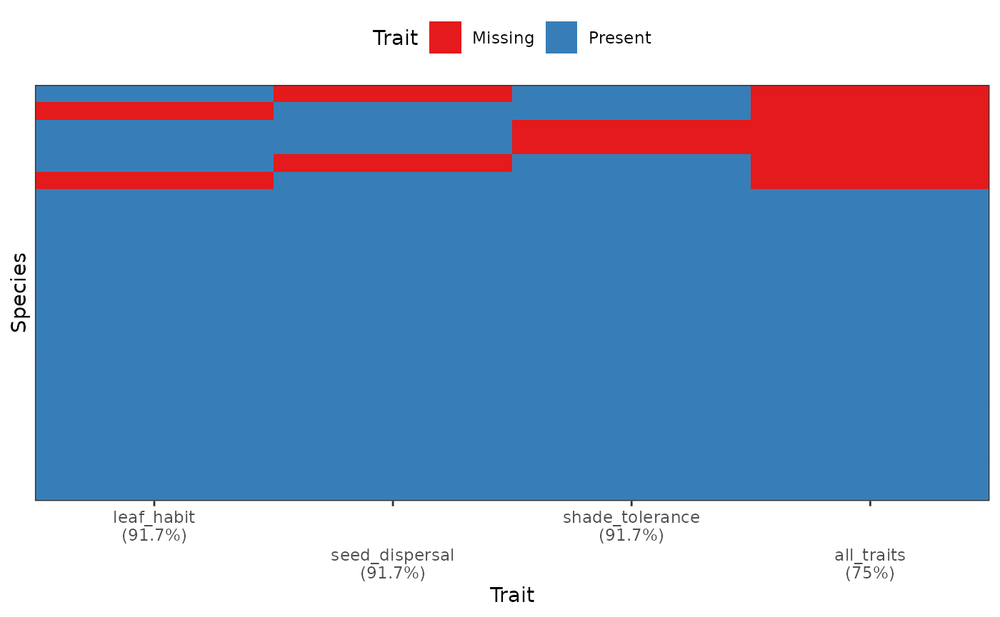
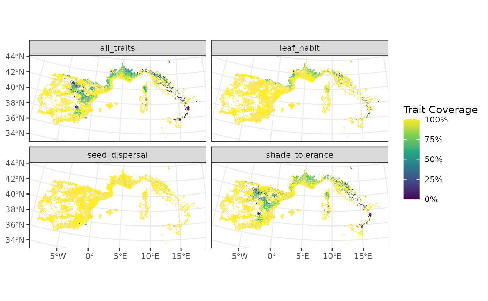
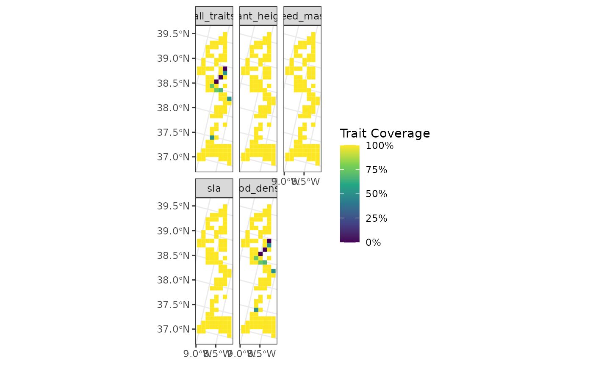
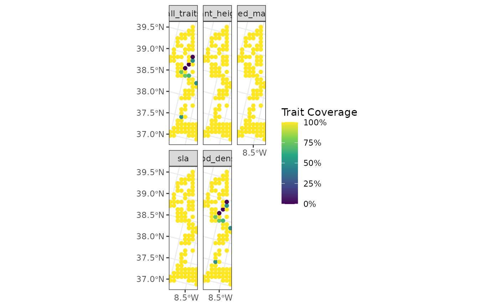
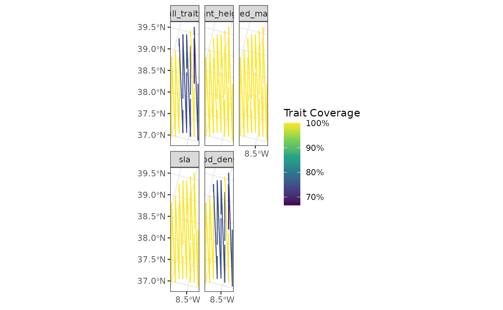
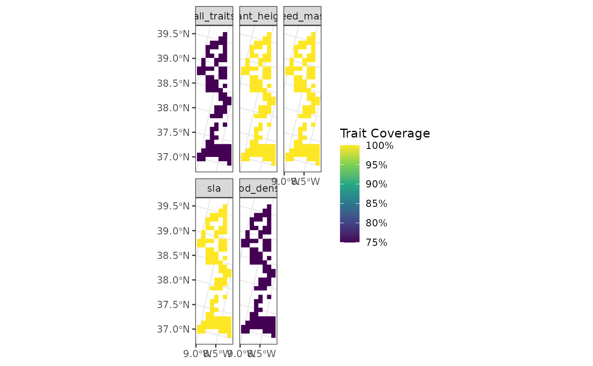

# Special cases in funbiogeo

``` r

library(funbiogeo)
```

This vignette aims to describe several specific cases in the use of
`funbiogeo`. It provides detailed examples of these uses. If you find
your case is missing or if you have additional questions, please [open
an issue](https://github.com/FRBCesab/funbiogeo/issues/new/choose).

## Working with Categorical Traits

Traits are not always continuous. While `funbiogeo` has been thought
mainly to work with continuous trait data, it can also work with
categorical trait data. This section describes how to use `funbiogeo` to
work with categorical traits.

The default dataset provided in `funbiogeo` is an extract of the [WOODIV
database](https://doi.org/10.1038/s41597-021-00873-3), describing the
diversity of Mediterrannean trees. It contains data for 28 species. To
focus on categorical traits, we here propose to add three more traits
for each species: its leaf habit (whether is deciduous or not?), its
seed dispersal mode, and its shade tolerance. The next chunk gives these
traits for the 24 species. We coded seed dispersal as a categorical
trait with two modalities `"anemochory"` and `"endozoochory"`. We coded
shade tolerance as a categorical traits with five ordered levels
`"very_intolerant"`, `"intolerant"`, `"moderately_tolerant"`,
`"tolerant"`, and `"very_tolerant"`. We first give the complete dataset,
and then randomly remove data points to show the abilities of
`funbiogeo` to display missing categorical traits.

``` r

woodiv_cat <- data.frame(
  species = c(
    "AALB",
    "ACEP",
    "ANEB",
    "APIN",
    "CLIB",
    "CSEM",
    "JCOM",
    "JDEL",
    "JMAC",
    "JNAV",
    "JOXY",
    "JPHO",
    "JTHU",
    "PBRU",
    "PHAL",
    "PHEL",
    "PINI",
    "PMUG",
    "PPIA",
    "PPIR",
    "PSYL",
    "PUNC",
    "TART",
    "TBAC"
  ),
  leaf_habit = c("evergreen"),
  seed_dispersal = c(
    "anemochory",
    "anemochory",
    "anemochory",
    "anemochory",
    "anemochory",
    "anemochory",
    "endozoochory",
    "endozoochory",
    "endozoochory",
    "endozoochory",
    "endozoochory",
    "endozoochory",
    "endozoochory",
    "anemochory",
    "anemochory",
    "anemochory",
    "anemochory",
    "anemochory",
    "endozoochory",
    "anemochory",
    "anemochory",
    "anemochory",
    "anemochory",
    "endozoochory"
  ),
  shade_tolerance = c(
    "tolerant",
    "moderately_tolerant",
    "moderately_tolerant",
    "moderately_tolerant",
    "moderately_tolerant",
    "intolerant",
    "intolerant",
    "intolerant",
    "intolerant",
    "intolerant",
    "intolerant",
    "intolerant",
    "intolerant",
    "very_intolerant",
    "very_intolerant",
    "intolerant",
    "intolerant",
    "intolerant",
    "intolerant",
    "intolerant",
    "intolerant",
    "intolerant",
    "very_intolerant",
    "very_tolerant"
  )
)

head(woodiv_cat)
#>   species leaf_habit seed_dispersal     shade_tolerance
#> 1    AALB  evergreen     anemochory            tolerant
#> 2    ACEP  evergreen     anemochory moderately_tolerant
#> 3    ANEB  evergreen     anemochory moderately_tolerant
#> 4    APIN  evergreen     anemochory moderately_tolerant
#> 5    CLIB  evergreen     anemochory moderately_tolerant
#> 6    CSEM  evergreen     anemochory          intolerant
```

Then to simulate missing trait data, we randomly remove 20% of the
values:

``` r

# Randomly removes 20% of the values
set.seed(20260411)

woodiv_cat_na <- apply(
  woodiv_cat[, 2:4],
  2,
  function(x) {
    x[sample(c(1:24), floor(24 / 10))] <- NA
    x
  }
)

woodiv_cat_na <- as.data.frame(woodiv_cat_na)

woodiv_cat_na$species <- woodiv_cat$species

woodiv_cat_na <- woodiv_cat_na[, c(4, 1:3)]

woodiv_cat_na$shade_tolerance <- factor(
  woodiv_cat_na$shade_tolerance,
  levels = c(
    "very_intolerant",
    "intolerant",
    "moderately_tolerant",
    "tolerant",
    "very_tolerant"
  ),
  ordered = TRUE
)

head(woodiv_cat_na)
#>   species leaf_habit seed_dispersal     shade_tolerance
#> 1    AALB       <NA>     anemochory            tolerant
#> 2    ACEP  evergreen           <NA> moderately_tolerant
#> 3    ANEB  evergreen     anemochory moderately_tolerant
#> 4    APIN  evergreen     anemochory moderately_tolerant
#> 5    CLIB  evergreen     anemochory moderately_tolerant
#> 6    CSEM  evergreen     anemochory          intolerant
```

We can now use all of the functions of `funbiogeo` as with continuous
trait data:

``` r

# Show trait completeness overall
fb_plot_species_traits_completeness(woodiv_cat_na)
```



``` r

# Map site completeness per trait
fb_map_site_traits_completeness(
  woodiv_locations,
  woodiv_site_species,
  woodiv_cat_na
)
```



**Note**: the only two functions of `funbiogeo` that won’t work with
categorical traits are
[`fb_cwm()`](https://frbcesab.github.io/funbiogeo/reference/fb_cwm.md)
which computes an abundance-weighted trait average, and
[`fb_plot_trait_correlation()`](https://frbcesab.github.io/funbiogeo/reference/fb_plot_trait_correlation.md)
which displays trait-trait correlations.

## Considering Intraspecific Variation

Trait-based ecology tends to present its frameworks and analyses with
species average traits, most of its concepts can, however, apply to
intraspecific trait variation, `funbiogeo` is no different. All of the
examples, including the dataset provided with the package, show species
average traits. In this section, we detail how to work with data that
include intraspecific variation within `funbiogeo`. This should be
fairly similar to what’s possible across other functional diversity R
packages.

To include intraspecific variation, the user has to index species within
specific sites. For example, if they are three individuals of *Abies
alba* in site *A*, then the user has to provide different names to the
different individuals like `Abies_alba_1`, `Abies_alba_2`, and
`Abies_alba_3`. These names have to be reused consistently across
objects `site_species`, `species_traits`, and `species_categories`. As
such, the user can define as fine as possible intraspecific variation.
It is also possible to provide individual trait value for one or several
sites and species average trait for the rest of the sites, following the
same idea as long as the naming of species and invidivuals is consistent
across objects. In this case, the specified individuals will be
counfounded as distinct species in trait completeness plots.

## Sites of Arbitrary Shapes

`funbiogeo` contains functions that require site-level data. A “site” is
here defined as any geographic grain in which the studied organisms
occur. Depending on the underlying scientific question, a site could be
a single geographic point, for example marking a precise sampled
location, or it could be a polygon (e.g., the area of a protected area),
or a (multi-)line (e.g., a transect or a sampling route), or a square in
a grid (e.g., through a sampling grid). The `fb_map_*()` functions in
`funbiogeo` are agnostic to the shape of the sites, meaning they will
work whatever the nature of the sites. The outputs will be adapted to
the nature of the sites. In this section, we will show examples with
sites of different types and see how this affects the output given by
`funbiogeo` mapping functions.

We will first select the 100 first sites in the `woodiv_locations`
object:

``` r

sampled_sites <- woodiv_locations[1:100, ]

fb_map_site_traits_completeness(
  sampled_sites,
  woodiv_site_species,
  woodiv_traits
)
```



We will now convert the sites to points by taking the centroid of sites
and use `fb_map_*()` functions to see how it will affect their outputs:

``` r

# Convert all the sites into 'POINT' geometry
points_sites <- sf::st_centroid(sampled_sites)
#> Warning: st_centroid assumes attributes are constant over geometries

points_sites
#> Simple feature collection with 100 features and 2 fields
#> Geometry type: POINT
#> Dimension:     XY
#> Bounding box:  xmin: 2635000 ymin: 1745000 xmax: 2705000 ymax: 2045000
#> Projected CRS: ETRS89-extended / LAEA Europe
#> First 10 features:
#>        site  country                geometry
#> 1  26351755 Portugal POINT (2635000 1755000)
#> 2  26351765 Portugal POINT (2635000 1765000)
#> 4  26351955 Portugal POINT (2635000 1955000)
#> 5  26351965 Portugal POINT (2635000 1965000)
#> 6  26451755 Portugal POINT (2645000 1755000)
#> 7  26451765 Portugal POINT (2645000 1765000)
#> 8  26451775 Portugal POINT (2645000 1775000)
#> 10 26451955 Portugal POINT (2645000 1955000)
#> 11 26451965 Portugal POINT (2645000 1965000)
#> 12 26451975 Portugal POINT (2645000 1975000)

# Map the sites
fb_map_site_traits_completeness(
  points_sites,
  woodiv_site_species,
  woodiv_traits
)
```



As seen above, the sites are now actual points instead of the original
squares. The function will adapt to the geometry of the sites provided
by the user.

But `funbiogeo` can accommodate sites of any geometry, to show sites
that represent lines, we will group sites into lines of sites and use
the same function.

``` r

lines_sites <- points_sites

# Assign groups to create 10 lines
site_ids <- data.frame(
  site = points_sites$site,
  group_line = rep(1:10, each = 10)
)

# Group sites geographically
lines_sites <- lines_sites |>
  dplyr::inner_join(site_ids, by = "site") |>
  dplyr::group_by(group_line) |>
  dplyr::summarise(country = unique(country)) |>
  sf::st_cast("LINESTRING") |>
  dplyr::rename(site = group_line)

lines_sites
#> Simple feature collection with 10 features and 2 fields
#> Geometry type: LINESTRING
#> Dimension:     XY
#> Bounding box:  xmin: 2635000 ymin: 1745000 xmax: 2705000 ymax: 2045000
#> Projected CRS: ETRS89-extended / LAEA Europe
#> # A tibble: 10 × 3
#>     site country                                                        geometry
#>    <int> <chr>                                                  <LINESTRING [m]>
#>  1     1 Portugal (2635000 1755000, 2635000 1765000, 2635000 1955000, 2635000 1…
#>  2     2 Portugal (2645000 1985000, 2655000 1765000, 2655000 1775000, 2655000 1…
#>  3     3 Portugal (2655000 1995000, 2655000 2005000, 2655000 2015000, 2665000 1…
#>  4     4 Portugal (2665000 1855000, 2665000 1915000, 2665000 1925000, 2665000 1…
#>  5     5 Portugal (2675000 1775000, 2675000 1785000, 2675000 1805000, 2675000 1…
#>  6     6 Portugal (2675000 1935000, 2675000 1975000, 2675000 1985000, 2675000 2…
#>  7     7 Portugal (2685000 1865000, 2685000 1875000, 2685000 1895000, 2685000 1…
#>  8     8 Portugal (2685000 2025000, 2685000 2035000, 2695000 1755000, 2695000 1…
#>  9     9 Portugal (2695000 1895000, 2695000 1905000, 2695000 1925000, 2695000 1…
#> 10    10 Portugal (2695000 2025000, 2695000 2035000, 2695000 2045000, 2705000 1…

# Group sites in woodiv_site_species
woodiv_site_lines <- woodiv_site_species |>
  dplyr::inner_join(site_ids) |>
  dplyr::select(-site) |>
  dplyr::rename(site = group_line) |>
  dplyr::group_by(site) |>
  dplyr::summarise(
    dplyr::across(dplyr::everything(), function(x) as.numeric(sum(x) > 0))
  )
#> Joining with `by = join_by(site)`


fb_map_site_traits_completeness(
  lines_sites,
  woodiv_site_lines,
  woodiv_traits
)
```



The geometry now displays the lines, even though they are not the most
perfect representation of the actual sites, but it shows the
capabilities of funbiogeo.

Similarly to the [upscaling
vignette](https://frbcesab.github.io/funbiogeo/articles/vignettes/upscaling.Rmd),
the map functions can also accommodate larger polygons, for example by
aggregating sites per country.

``` r

# Convert all sites to a single polygon
polygon_sites <- sampled_sites |>
  dplyr::group_by(country) |>
  dplyr::summarise(country = unique(country)) |>
  sf::st_cast("MULTIPOLYGON") |>
  dplyr::rename(site = country)

# Compute new site-species object
woodiv_site_polygon <- woodiv_site_species |>
  subset(site %in% sampled_sites$site) |>
  dplyr::select(-site) |>
  dplyr::mutate(site = "Portugal") |>
  dplyr::group_by(site) |>
  dplyr::summarise(
    dplyr::across(dplyr::everything(), function(x) as.numeric(sum(x) > 0))
  )

# Display the map
fb_map_site_traits_completeness(
  polygon_sites,
  woodiv_site_polygon,
  woodiv_traits
)
```



Now all of the sites are merged as a single big polygon.

Have fun with `funbiogeo` and if you have a question, an issue, or a
suggestion, make sure to fill a report [on
GitHub](https://github.com/FRBCesab/funbiogeo/issues/new).
