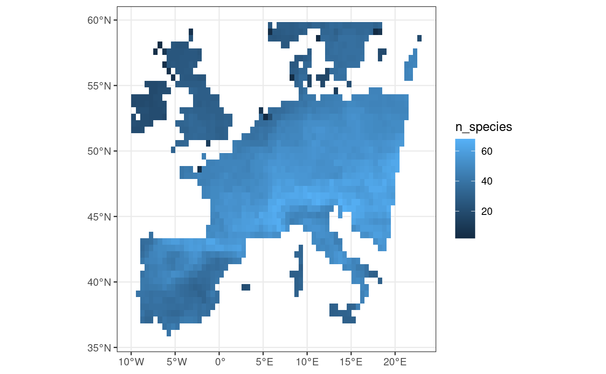
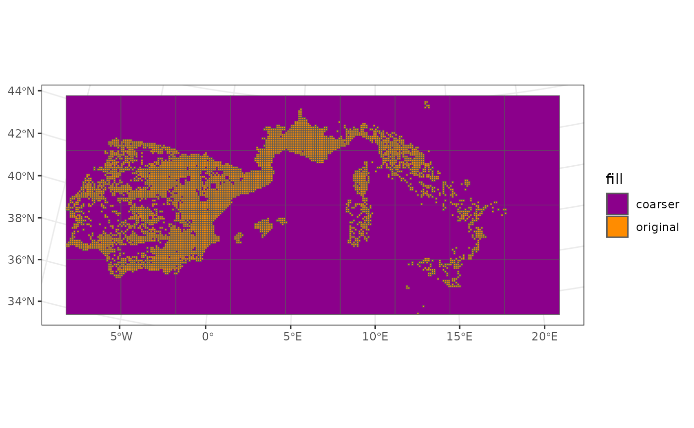
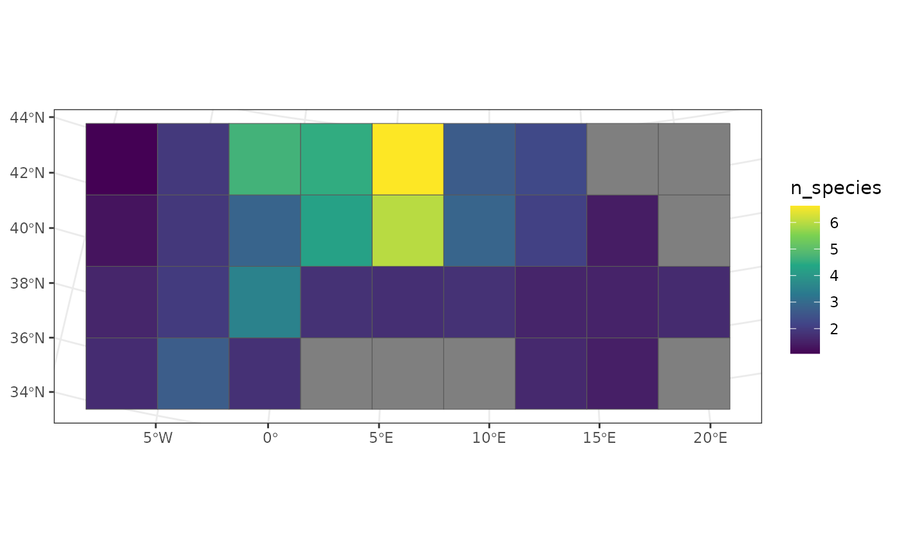
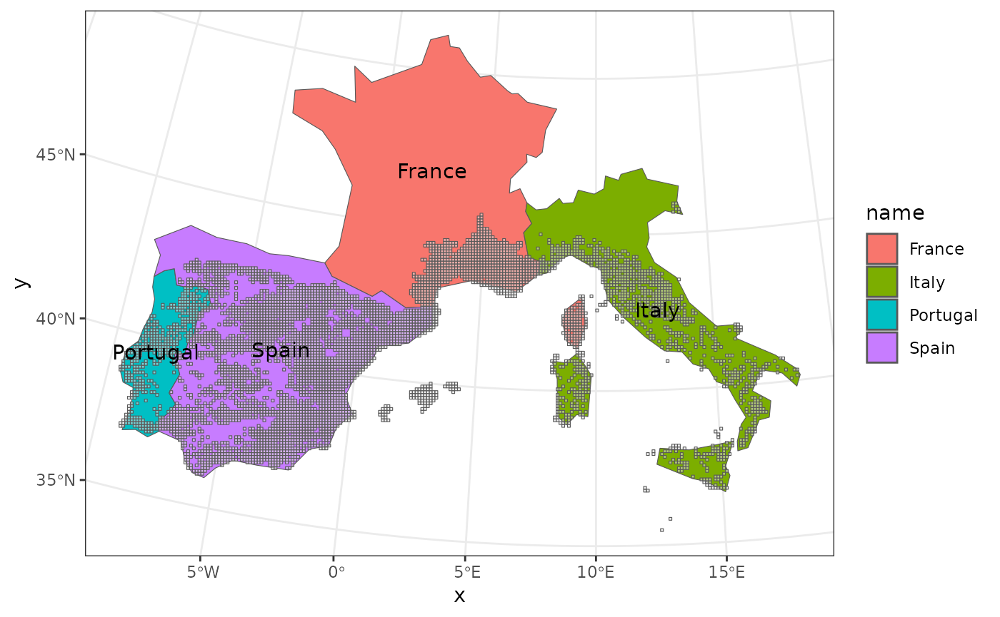
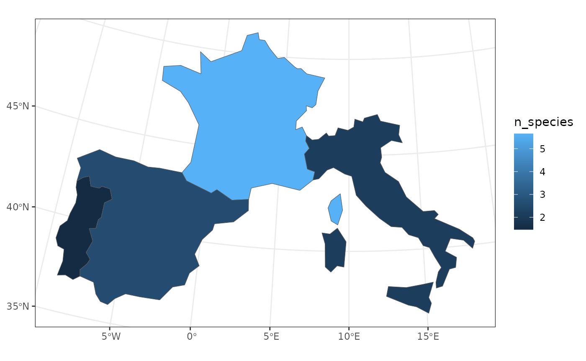
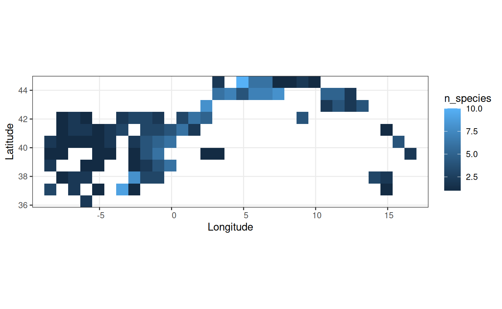
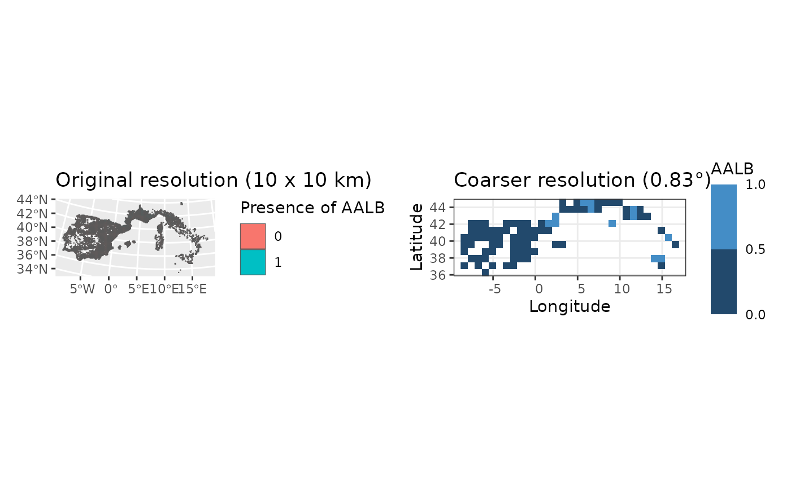
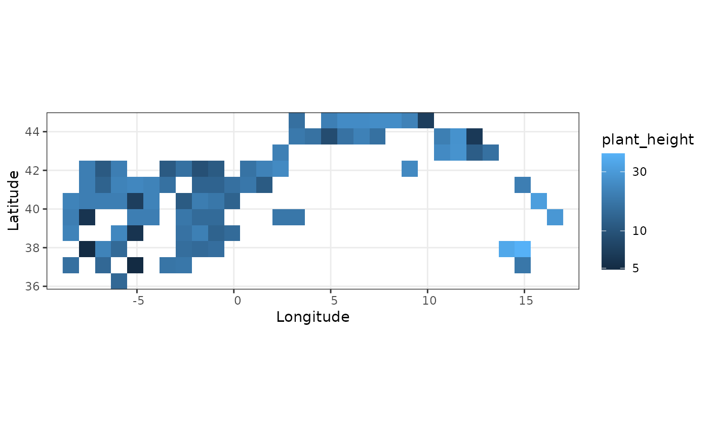
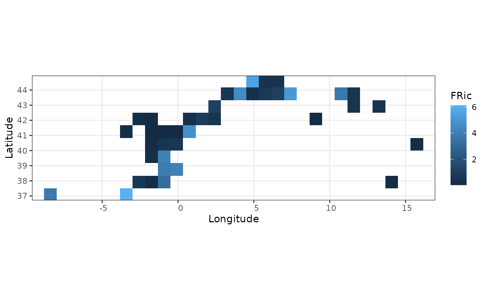

# Upscaling your data: aggregating at coarser scales

`funbiogeo` provides an easy way to upscale your site data to a coarser
resolution. The idea is that you have any type of data at the site level
(diversity metrics, environmental data, as well as site-species data)
that you would like to work on or visualize at a coarser scale. The
aggregation process can look daunting at first and be quite difficult to
run. We explain in details, throughout this vignette, how to do so with
the
[`fb_aggregate_site_data()`](https://frbcesab.github.io/funbiogeo/reference/fb_aggregate_site_data.md)
function. We’ll detail three use cases:

1.  Aggregating through a regular square grid
2.  Aggregating to irregular polygons (like countries, biomes, or any
    other shape )
3.  Aggregating using a raster grid

In all three cases, the aggregation can work on any data available at
the site-level. This could be species richness, site-species data, or
functional diversity metrics.

## Preamble: getting site-level data

``` r
library("funbiogeo")
library("sf")
#> Linking to GEOS 3.12.1, GDAL 3.8.4, PROJ 9.4.0; sf_use_s2() is TRUE
library("ggplot2")
```

Let’s import our site by locations object, which describes the
geographical locations of sites.

``` r
data("woodiv_locations")

woodiv_locations
#> Simple feature collection with 5366 features and 2 fields
#> Geometry type: POLYGON
#> Dimension:     XY
#> Bounding box:  xmin: 2630000 ymin: 1380000 xmax: 5040000 ymax: 2550000
#> Projected CRS: ETRS89-extended / LAEA Europe
#> First 10 features:
#>        site  country                       geometry
#> 1  26351755 Portugal POLYGON ((2630000 1750000, ...
#> 2  26351765 Portugal POLYGON ((2630000 1760000, ...
#> 4  26351955 Portugal POLYGON ((2630000 1950000, ...
#> 5  26351965 Portugal POLYGON ((2630000 1960000, ...
#> 6  26451755 Portugal POLYGON ((2640000 1750000, ...
#> 7  26451765 Portugal POLYGON ((2640000 1760000, ...
#> 8  26451775 Portugal POLYGON ((2640000 1770000, ...
#> 10 26451955 Portugal POLYGON ((2640000 1950000, ...
#> 11 26451965 Portugal POLYGON ((2640000 1960000, ...
#> 12 26451975 Portugal POLYGON ((2640000 1970000, ...
```

These sites are a collection of regular spatial polygons at a resolution
of 10 km x 10 km over South Western Europe. Our site by locations object
is an `sf` object, which means it’s a spatial object coupled with a
data.frame.

For each site, we want to compute the species richness. We can do so by
counting the species at each site with the function
[`fb_count_species_by_site()`](https://frbcesab.github.io/funbiogeo/reference/fb_count_species_by_site.md).

``` r
# Import site x species data
data("woodiv_site_species")

# Compute species richness
species_richness <- fb_count_species_by_site(woodiv_site_species)

head(species_richness)
#>       site n_species  coverage
#> 1 40552295        12 0.5000000
#> 2 39252405        12 0.5000000
#> 3 37752305        12 0.5000000
#> 4 39852255        12 0.5000000
#> 5 39152415        12 0.5000000
#> 6 39552415        11 0.4583333
```

Unfortunately, the
[`fb_count_species_by_site()`](https://frbcesab.github.io/funbiogeo/reference/fb_count_species_by_site.md)
doesn’t output a spatial object but a data.frame with three columns: the
identifier of the site, the number of species, and the proportion of
species present at a given site. Before going any further let’s put
species richness on the map with the function
[`fb_map_site_data()`](https://frbcesab.github.io/funbiogeo/reference/fb_map_site_data.md).
That function allows us to represent any arbitrary data at the site
level by combining it with the site by locations object, and it shows a
map of that data:

``` r
fb_map_site_data(woodiv_locations, species_richness, "n_species")
```



Now, from this site-level species richness, we would like to get the
species richness at different scales. First, we’ll show how to aggregate
on a coarser square grid, then at the country level, and then with a
grid from a `SpatRaster`.

## Aggregating through a square grid

Our initial sites are 10km by 10km, we want to aggregate using a grid
with pixels of 300km by 300km. When aggregating with a such a grid,
there are two possibilities: either you already have a defined grid as a
spatial object or you generate one on the fly. Here we’ll generate the
grid on the fly using the function
[`st_make_grid()`](https://r-spatial.github.io/sf/reference/st_make_grid.html)
from the `sf` package.

Because our data are using a [map
projection](https://en.wikipedia.org/wiki/Map_projection) with units in
meters, we can directly specify the `cellsize` argument of
[`st_make_grid()`](https://r-spatial.github.io/sf/reference/st_make_grid.html).
The function the locations object as first argument, then a vector of
two nubmers as the second argument defining the cell sizes. By default,
the newly created grid will cover the same extent as in the input
spatial data.

``` r
coarser_grid <- sf::st_make_grid(woodiv_locations, cellsize = c(300e3, 300e3))

head(coarser_grid)
#> Geometry set for 6 features 
#> Geometry type: POLYGON
#> Dimension:     XY
#> Bounding box:  xmin: 2630000 ymin: 1380000 xmax: 4430000 ymax: 1680000
#> Projected CRS: ETRS89-extended / LAEA Europe
#> First 5 geometries:
#> POLYGON ((2630000 1380000, 2930000 1380000, 293...
#> POLYGON ((2930000 1380000, 3230000 1380000, 323...
#> POLYGON ((3230000 1380000, 3530000 1380000, 353...
#> POLYGON ((3530000 1380000, 3830000 1380000, 383...
#> POLYGON ((3830000 1380000, 4130000 1380000, 413...
```

Because the coarser grid is an `sfc` object, we need to transform it to
an `sf` object to be fully compatible with
[`fb_aggregate_site_data()`](https://frbcesab.github.io/funbiogeo/reference/fb_aggregate_site_data.md).
We do so in the next chunk:

``` r
coarser_grid <- sf::st_as_sf(coarser_grid)

coarser_grid
#> Simple feature collection with 36 features and 0 fields
#> Geometry type: POLYGON
#> Dimension:     XY
#> Bounding box:  xmin: 2630000 ymin: 1380000 xmax: 5330000 ymax: 2580000
#> Projected CRS: ETRS89-extended / LAEA Europe
#> First 10 features:
#>                                 x
#> 1  POLYGON ((2630000 1380000, ...
#> 2  POLYGON ((2930000 1380000, ...
#> 3  POLYGON ((3230000 1380000, ...
#> 4  POLYGON ((3530000 1380000, ...
#> 5  POLYGON ((3830000 1380000, ...
#> 6  POLYGON ((4130000 1380000, ...
#> 7  POLYGON ((4430000 1380000, ...
#> 8  POLYGON ((4730000 1380000, ...
#> 9  POLYGON ((5030000 1380000, ...
#> 10 POLYGON ((2630000 1680000, ...
```

Now that we have a new grid, we can plot it with the original site
locations data to make sure it is sensible, compared to what we wanted.
We will do so using the
[`geom_sf()`](https://ggplot2.tidyverse.org/reference/ggsf.html)
function from `ggplot2`.

``` r
ggplot() +
  geom_sf(data = coarser_grid, aes(fill = "coarser")) +
  geom_sf(data = woodiv_locations, aes(fill = "original")) +
  # Color the grids
  scale_fill_manual(
    values = c(original = "darkorange", coarser = "darkmagenta")
  ) +
  theme_bw()
```



In orange, you see the original data grid of the data, while in purple
is the coarser grid we defined over which we’ll aggregate the data.

We’re interested in knowing the occurrence of our Mediterranean plant
species over each pixel of the coarser grid. To do this we’ll use the
[`fb_aggregate_site_data()`](https://frbcesab.github.io/funbiogeo/reference/fb_aggregate_site_data.md)
function from `funbiogeo`. It takes as first argument the site-locations
object (including the column with the site ids), then the data that
needs to be aggregated (with the site ids column), then the grid over
which to aggregate the data, finally the last argument is the function
to use to aggregate the data. By default, uses the
[`mean()`](https://rdrr.io/r/base/mean.html) function and assumes
quantitative site data only.

Because we’re interested in species richness, we’ll use the dataset we
computed in the first section, that defines species richness at each
site. We’ll use the
[`fb_aggregate_site_data()`](https://frbcesab.github.io/funbiogeo/reference/fb_aggregate_site_data.md)
function on our original site-locations object, with the species
richness data, on the coarser grid, using the
[`mean()`](https://rdrr.io/r/base/mean.html) function to get back the
average species richness across sites per larger pixel.

``` r
coarser_richness <- fb_aggregate_site_data(
  woodiv_locations, species_richness, coarser_grid, fun = mean
)

head(coarser_richness)
#> Simple feature collection with 6 features and 2 fields
#> Geometry type: POLYGON
#> Dimension:     XY
#> Bounding box:  xmin: 2630000 ymin: 1380000 xmax: 4430000 ymax: 1680000
#> Projected CRS: ETRS89-extended / LAEA Europe
#>   n_species   coverage                       geometry
#> 1  1.700000 0.07083333 POLYGON ((2630000 1380000, ...
#> 2  2.690821 0.11211755 POLYGON ((2930000 1380000, ...
#> 3  1.795918 0.07482993 POLYGON ((3230000 1380000, ...
#> 4        NA         NA POLYGON ((3530000 1380000, ...
#> 5        NA         NA POLYGON ((3830000 1380000, ...
#> 6        NA         NA POLYGON ((4130000 1380000, ...
```

Note that the object we obtain is also an `sf` object of the same type
as the `grid` we provided.

We can plot it using `ggplot2`:

``` r
ggplot(coarser_richness, aes(fill = n_species)) +
  geom_sf() +
  scale_fill_viridis_c() +
  theme_bw()
```



We see that the pixels of the North show the greatest average species
richness, especially in the South of France.

## Aggregating through irregular polygons

We aggregated our richness data on a regular grid with square pixels,
but it is very common in biogeography to want to aggregate data on
spatial objects that are of irregular shapes. For example, aggregating
data at the biome or the country scale. Initially, our data may be on a
regular grid, but we want to aggregate at the country scale. This is
easily doable with the
[`fb_aggregate_site_data()`](https://frbcesab.github.io/funbiogeo/reference/fb_aggregate_site_data.md)
function.

The function actually works with any arbitrary `sf` object as
aggregation grid whether it’s polygons regular or not, lines, points, or
a mix of any geometries.

To show you how to do it, we’ll use the included spatial object for the
four Mediterrannean countries covered by our example dataset:

``` r
# Load the file from the package folder
countries <- readRDS(
  system.file("extdata", "countries_sf.rds", package = "funbiogeo")
)

# Visualize the spatial object
ggplot(countries) +
  geom_sf(aes(fill = name)) +
  geom_sf(data = woodiv_locations, alpha = 1/2) +  # Add original data
  geom_sf_text(aes(label = name)) +
  theme_bw()
```



As we already have our aggregation object, here the countries
delimitation, we can directly use the
[`fb_aggregate_site_data()`](https://frbcesab.github.io/funbiogeo/reference/fb_aggregate_site_data.md)
function on: the original locations, the species richness data, and the
countries object, with the [`mean()`](https://rdrr.io/r/base/mean.html)
function. As such, we’ll obtain the average species richness in
Mediterrannean tree species per country. Note that all the sites that
are not covered by the aggregation polygons (here the countries) are
going to be dropped.

``` r
# Compute country-level average species richness
countries_richness <- fb_aggregate_site_data(
  woodiv_locations, species_richness, countries, fun = mean
)

# Map country-level average species richness
ggplot(countries_richness) +
  geom_sf(aes(fill = n_species)) +
  theme_bw()
```



We observe that France has a higher species richness than the other
countries, with more than 5 species on average in the sites it harbors.

## Aggregating through a SpatRaster grid

In the two previous sections we saw how to aggregate on arbitrary shaped
polygons. However, another quite common use case, especially when
working with species distribution model, is to want to aggregate data
follow an environmental raster or a raster grid.

We would now like to aggregate our sites at the same resolution as is
available for our environmental data such as mean annual temperature. We
need to aggregate site data on a `SpatRaster` spatial grid (from the
[`terra`](https://cran.r-project.org/package=terra) package). A nice
property of
[`fb_aggregate_site_data()`](https://frbcesab.github.io/funbiogeo/reference/fb_aggregate_site_data.md)
function is that it outputs a matching type of object as the provided
grid. If it’s an `sf` object than the function will output the same type
of `sf` object, while if it’s a `SpatRaster` then it will give back a
`SpatRaster` object.

First of all, we can create a coarser grid based on our locations
object.

``` r
# Import study area grid
coarser_grid <- system.file("extdata", "grid_area.tif", package = "funbiogeo")
coarser_grid <- terra::rast(coarser_grid)

coarser_grid
#> class       : SpatRaster 
#> size        : 29, 41, 1  (nrow, ncol, nlyr)
#> resolution  : 0.8333333, 0.8333333  (x, y)
#> extent      : -10.5, 23.66667, 35.83333, 60  (xmin, xmax, ymin, ymax)
#> coord. ref. : lon/lat WGS 84 (EPSG:4326) 
#> source      : grid_area.tif 
#> name        : value 
#> min value   :     1 
#> max value   :     1
```

We will aggregate the site data (resolution of 10 km by 10 km) to this
new coarser raster (resolution of 0.83°, close to 92 km by 92km) with
the function
[`fb_aggregate_site_data()`](https://frbcesab.github.io/funbiogeo/reference/fb_aggregate_site_data.md).
This function requires the following arguments:

- `site_locations`: the site x locations object
- `site_data`: a `matrix` or `data.frame` containing values per sites to
  aggregate on the provided grid `agg_geom`. Can have one or several
  columns (variables to aggregate). The first column must contain sites
  names as provided in the object `species_richness`
- `agg_geom`: a `SpatRaster` object (package `terra`). A raster of one
  single layer, that defines the grid along which to aggregate
- `fun`: the function used to aggregate sites values when there are
  multiple sites in one cell (do we want to get the minimum value? the
  maximum? the sum? or the mean?)

Let’s compute our average species richness values across our grid.

``` r
# Upscale to grid ----
upscaled_richness <- fb_aggregate_site_data(
  site_locations = woodiv_locations[ , 1, drop = FALSE],
  site_data      = species_richness[ , 1:2],
  agg_geom       = coarser_grid,
  fun            = mean
)

upscaled_richness
#> class       : SpatRaster 
#> size        : 29, 41, 1  (nrow, ncol, nlyr)
#> resolution  : 0.8333333, 0.8333333  (x, y)
#> extent      : -10.5, 23.66667, 35.83333, 60  (xmin, xmax, ymin, ymax)
#> coord. ref. : lon/lat WGS 84 (EPSG:4326) 
#> source(s)   : memory
#> varname     : grid_area 
#> name        : n_species 
#> min value   :         1 
#> max value   :        10
```

We get a `SpatRaster` object that is of the same resolution of our
provided `agg_geom` raster grid. The cells of this raster contain the
averaged values of species richness of our sites aggregated on the
coarser grid. We can plot these values through a call to
[`fb_map_raster()`](https://frbcesab.github.io/funbiogeo/reference/fb_map_raster.md)
which allows to plot rasters.

``` r
fb_map_raster(upscaled_richness)
```



## Specific examples

### Coarsening site-species data

Through the
[`fb_aggregate_site_data()`](https://frbcesab.github.io/funbiogeo/reference/fb_aggregate_site_data.md)
function we can also coarsen our site-species grid by selecting the
appropriate function as the `fun` argument, we detail how in this
section.

Now that we’ve learned how to aggregate arbitrary data at the site scale
over a spatial scale. We’re going to use our provided example named
`site_species` at a resolution of 10 x 10 km to get new sites from a
grid with pixels of 0.83° of resolution.

As shown in the previous section, we’ll need three objects:
`site_species`, which describes the species present across sites;
`site_locations`, which gives the spatial locations of sites; and
`agg_geom` which is a `SpatRaster` object defining the coarser grid.

We’ll use the previously defined object to run our example. To aggregate
the presence-absence of species within each pixel of the new grid, we’ll
use the [`max()`](https://rdrr.io/r/base/Extremes.html) function (as the
`fun` argument). As such, coarser pixels which contains a mix of
presence and absence of certain species, we’ll be considered as having
the species present. Only when the species is absent from all of the
finer scale sites will the coarser pixel show the species as absent.

``` r
site_species_agg <- fb_aggregate_site_data(
  woodiv_locations[ , 1, drop = FALSE],
  woodiv_site_species,
  agg_geom = coarser_grid,
  fun = max
)
```

The return object is a `SpatRaster` as well but can be transformed
easily in a data.frame to follow back with the regular analyses provided
in `funbiogeo`. The new object contains one layer for each aggregated
variable, i.e. here, one per species.

``` r
site_species_agg
#> class       : SpatRaster 
#> size        : 29, 41, 24  (nrow, ncol, nlyr)
#> resolution  : 0.8333333, 0.8333333  (x, y)
#> extent      : -10.5, 23.66667, 35.83333, 60  (xmin, xmax, ymin, ymax)
#> coord. ref. : lon/lat WGS 84 (EPSG:4326) 
#> source(s)   : memory
#> varnames    : grid_area 
#>               grid_area 
#>               grid_area 
#>               ...
#> names       : AALB, ACEP, APIN, CLIB, CSEM, JCOM, ... 
#> min values  :    0,    0,    0,    0,    0,    0, ... 
#> max values  :    1,    1,    1,    0,    1,    1, ...
```

We can visualize both maps for a single species to see the difference in
resolution :

``` r

single_species <- merge(
  woodiv_locations, woodiv_site_species[, 1:2], by = "site", all = TRUE
)

finer_map <- ggplot(single_species) +
  geom_sf(aes(fill = as.factor(AALB))) +
  labs(fill = "Presence of AALB", title = "Original resolution (10 x 10 km)")

coarser_map <- fb_map_raster(site_species_agg[[1]]) +
  scale_fill_binned(breaks = c(0, 0.5, 1)) +
  labs(title = "Coarser resolution (0.83°)")

patchwork::wrap_plots(finer_map, coarser_map, nrow = 1)
```



#### Obtaining back a site x species `data.frame`

Now we obtained a raster of aggregated site-species presences. However,
the other functions of `funbiogeo` don’t play well with raster data.
They need data.frames to work well. We can do this through the specific
function [`as.data.frame()`](https://rdrr.io/r/base/as.data.frame.html)
in `terra` (make sure to check the dedicated help page that specifies
all the additional arguments with
[`?terra::as.data.frame`](https://rspatial.github.io/terra/reference/as.data.frame.html)).

``` r
# Use the 'cells = TRUE' argument to index results with a new cell column
# corresponding to the ID of the coarser grid pixels
site_species_agg_df <- terra::as.data.frame(site_species_agg, cells = TRUE)

site_species_agg_df[1:4, 1:4]
#>     cell AALB ACEP APIN
#> 755  755    0    0    0
#> 757  757    0    0    1
#> 758  758    1    0    0
#> 759  759    1    0    0

colnames(site_species_agg_df)[1] <- "site"
```

With this, we’re ready to reuse all of `funbiogeo` functions to work on
these coarser data. You can proceed similarly to aggregate the ancillary
site-related data, to use them in the rest of the analyses.

### Upscaling functional diversity data

Because `funbiogeo` focuses on the functional biogeography workflow,
we’ll explore in this section how to aggregate the results for a
functional biogeography function. First, we’ll detail an example
aggregating the community-weighted mean (CWM) of plant height, that is
the abundance-weighted trait average of the assemblage. Second, we’ll
show an example of coarsing functional diversity metrics computed
through the [`fundiversity`](https://funecology.github.io/fundiversity/)
package.

#### Coarsen CWM of plant height

To compute the CWM we’ll use the function
[`fb_cwm()`](https://frbcesab.github.io/funbiogeo/reference/fb_cwm.md).

``` r
site_cwm <- fb_cwm(woodiv_site_species, woodiv_traits[, 1:2])

head(site_cwm)
#>       site        trait      cwm
#> 1 26351755 plant_height 12.31767
#> 2 26351765 plant_height  4.88150
#> 3 26351955 plant_height 12.31767
#> 4 26351965 plant_height 13.77575
#> 5 26451755 plant_height  4.88150
#> 6 26451765 plant_height 15.76845
```

Now we can aggregate the CWM of plant hieght at coarser scale using
[`fb_aggregate_site_data()`](https://frbcesab.github.io/funbiogeo/reference/fb_aggregate_site_data.md)
as done in the previous sections, this time using the default `fun`
argument as we want to compute the average CWM:

``` r
colnames(site_cwm)[3] <- "plant_height"

upscaled_cwm <- fb_aggregate_site_data(
  woodiv_locations[ , 1, drop = FALSE],
  site_cwm[, c(1, 3)],
  coarser_grid
)

upscaled_cwm
#> class       : SpatRaster 
#> size        : 29, 41, 1  (nrow, ncol, nlyr)
#> resolution  : 0.8333333, 0.8333333  (x, y)
#> extent      : -10.5, 23.66667, 35.83333, 60  (xmin, xmax, ymin, ymax)
#> coord. ref. : lon/lat WGS 84 (EPSG:4326) 
#> source(s)   : memory
#> varname     : grid_area 
#> name        : plant_height 
#> min value   :      4.88150 
#> max value   :     42.14307
```

We can then map the CWM using the
[`fb_map_raster()`](https://frbcesab.github.io/funbiogeo/reference/fb_map_raster.md)
function:

``` r
fb_map_raster(upscaled_cwm) +
  scale_fill_continuous(trans = "log10")
```



#### Coarser FRic through `fundiversity`

In a similar fashion as in the [introduction vignette to
`funbiogeo`](https://frbcesab.github.io/funbiogeo/articles/funbiogeo.Rmd)
in this section we’ll compute the Functional Richness using two traits
across our example dataset.

``` r
# Get all species for which we have both adult body mass and litter size
subset_traits <- woodiv_traits[
  , c("species", "plant_height", "seed_mass")
]
subset_traits <- subset(
  subset_traits, !is.na(plant_height) & !is.na(seed_mass)
)

# Transform trait data
subset_traits[["plant_height"]] <- as.numeric(
  scale(log10(subset_traits[["plant_height"]]))
)

subset_traits[["seed_mass"]] <- as.numeric(
  scale(subset_traits[["seed_mass"]])
)

# Filter site for which we have trait information for than 80% of species
subset_site <- fb_filter_sites_by_trait_coverage(
  woodiv_site_species, subset_traits, 0.8
)

subset_site <- subset_site[, c("site", subset_traits$species)]

# Remove first column and convert in rownames
rownames(subset_traits) <- subset_traits[["species"]]
subset_traits <- subset_traits[, -1]

rownames(subset_site) <- subset_site[["site"]]
subset_site <- subset_site[, -1]

# Compute FRic
site_fric <- fundiversity::fd_fric(
  subset_traits, subset_site
)
#> Warning in fundiversity::fd_fric(subset_traits, subset_site): Some sites had
#> less species than traits so returned FRic is 'NA'

head(site_fric)
#>       site      FRic
#> 1 41152325 1.0964687
#> 2 40852325 1.1380385
#> 3 40852345 1.1523280
#> 4 42552105 0.8201878
#> 5 41152315 1.1380385
#> 6 37452365        NA
```

We can now follow a similar upscaling process as in the previous
sections to compute the average functional richness at a coarser spatial
scale:

``` r
agg_fric <- fb_aggregate_site_data(
  woodiv_locations[ , 1, drop = FALSE], 
  site_fric, 
  coarser_grid
)

fb_map_raster(agg_fric)
#> Warning: Raster pixels are placed at uneven horizontal intervals and will be shifted
#> ℹ Consider using `geom_tile()` instead.
```


