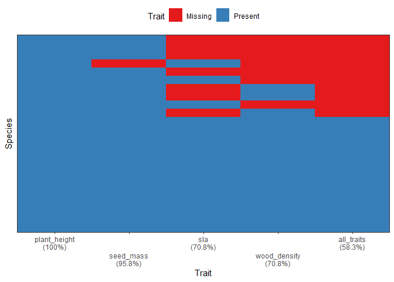
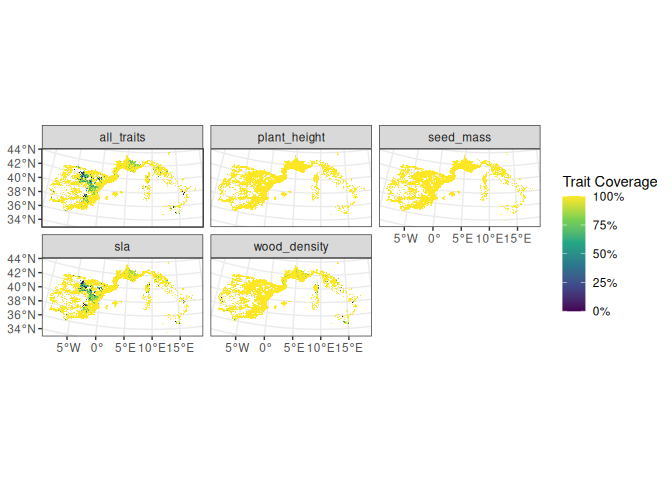

# funbiogeo

- [Overview](#overview)
- [Features](#features)
- [Installation](#installation)
- [First steps](#first-steps)
- [Long-form documentation (=vignettes)](#long-documentation)
- [Citation](#citation)
- [Contributing](#contributing)
- [Acknowledgments](#acknowledgments)
- [References](#references)

## Overview

The package `funbiogeo` aims to help users with analyses in functional
biogeography ([Violle *et al.* 2014](#references)), the biogeography of
species’ traits, by loading and combining data, exploring the
relationships between traits and their availability trait coverage,
providing many diagnostic plots to understand how to filter them,
producing maps, correlating them with the environment, and helping to
aggregate data at different scales It is aimed at first-timers of
functional biogeography as well as more experienced users who want to
obtain quick and easy exploratory plots.

Below is a quick introduction to the main features of `funbiogeo`, if
you want some more details about them, check [our
vignettes](#long-form-documentation).

## Features

`funbiogeo` offers:

- Standardized functions to filter and select your data for further
  analyses,
- Pleasing default diagnostic plots to visualize the structure of your
  data,
- Extensive documentation (multiple vignettes, well-documented
  functions, real-life example dataset) to guide you through functional
  biogeography analyses,
- Nice default plotting functions fully compatible with the outputs of
  functional diversity packages (`betapart`, `fundiversity`, `hillR`,
  `mFD`, etc.),
- A publication-ready automated standardized report that provide
  analyses and plots of your data,
- Functions to easily “upscale” (=aggregate) your data to coarser
  spatial resolutions whatever the type of aggregation geometry you want
  (regular grid, irregular polygons, and rasters).


Naming scheme of available functions in funbiogeo

## Installation

For the moment `funbiogeo` is not on CRAN but you can install the
development version from [R-universe](https://r-universe.dev) as follow:

``` r

install.packages("funbiogeo", repos = c("https://frbcesab.r-universe.dev", "https://cloud.r-project.org"))
```

## First steps

This section will show you some useful functions from `funbiogeo`. For a
longer introduction please refer to the [“Get started”
vignette](https://frbcesab.github.io/funbiogeo/articles/funbiogeo.html).

The package contains default example data named `woodiv_traits`,
`woodiv_site_species`, and `woodiv_locations` all from the WOODIV
database ([Monnet et al. 2021](#references)). You can, for example,
visualize the completeness of your trait dataset (which traits are known
for which proportion of species) using the
[`fb_plot_species_traits_completeness()`](https://frbcesab.github.io/funbiogeo/reference/fb_plot_species_traits_completeness.md)
function:

``` r

fb_plot_species_traits_completeness(woodiv_traits)
```



One other useful visualization is to see the trait coverage of each
trait across all sites, using the function
[`fb_map_site_traits_completeness()`](https://frbcesab.github.io/funbiogeo/reference/fb_map_site_traits_completeness.md):

``` r

fb_map_site_traits_completeness(woodiv_locations, woodiv_site_species, woodiv_traits)
```



See more features of `funbiogeo` in the [vignettes of the
package](https://frbcesab.github.io/funbiogeo/articles/)

## Long-form documentation

`funbiogeo` provides five vignettes to explain its functioning:

- A [“Get started”
  vignette](https://frbcesab.github.io/funbiogeo/articles/funbiogeo.html)
  that describes its core features and guide you through a typical
  analysis.
- A vignette on [all diagnostic
  plots](https://frbcesab.github.io/funbiogeo/articles/diagnostic-plots.html)
  provided in the package, which details how to use each plotting
  function and how to interpret their output.
- A vignette on [the data
  format](https://frbcesab.github.io/funbiogeo/articles/long-format.html)
  that `funbiogeo` needs, which shows you the use of specific functions
  to format your data to work well within `funbiogeo`.
- A vignette on [data
  upscaling](https://frbcesab.github.io/funbiogeo/articles/upscaling.html)
  which explains how to leverage `funbiogeo` to aggregate automatically
  your data to coarser grain and use them in further analyses.
- A vignette focusing on [special
  cases](https://frbcesab.github.io/funbiogeo/articles/special_cases.html),
  e.g. how to work with categorical traits, or how to consider
  intraspefic trait variations.

## Citation

At the moment, `funbiogeo` doesn’t offer a companion paper nor is it on
CRAN. But if you happen to use it in your paper you can cite the package
through:

> Casajus N & Grenié M (2026) *funbiogeo: Streamlining Functional
> Biogeography Analyses*. R package version 0.0.1,
> <https://github.com/frbcesab/funbiogeo/>.

You can also run:

``` r

citation("funbiogeo")
```

## Contributing

All types of contributions are encouraged and valued. For more
information, check out our [Contributor
Guidelines](https://github.com/FRBCesab/funbiogeo/blob/main/CONTRIBUTING.md).

Please note that the `funbiogeo` project is released with a [Contributor
Code of
Conduct](https://contributor-covenant.org/version/2/1/CODE_OF_CONDUCT.html).
By contributing to this project, you agree to abide by its terms.

## Acknowledgments

This package has been developed for the
[FRB-CESAB](https://www.fondationbiodiversite.fr/en/about-the-foundation/le-cesab/)
working group
[FREE](https://www.fondationbiodiversite.fr/en/the-frb-in-action/programs-and-projects/le-cesab/free/)
and its followup [FREE
2](https://www.fondationbiodiversite.fr/en/the-frb-in-action/programs-and-projects/le-cesab/free-2/)
that aims to advance the concept of functional rarity and examine the
causes and consequences of functional rarity from local to global
scales.

## References

Monnet, AC., Cilleros, K., Médail, F. et al. WOODIV, a database of
occurrences, functional traits, and phylogenetic data for all
Euro-Mediterranean trees. Sci Data 8, 89 (2021). DOI:
[10.1038/s41597-021-00873-3](https://doi.org/10.1038/s41597-021-00873-3)

Violle C, Reich, PB Pacala SW, *et al.* (2014) The emergence and promise
of functional biogeography. *Proceedings of the National Academy of
Sciences*, **111**, 13690-13696. DOI:
[10.1073/pnas.1415442111](https://www.pnas.org/doi/full/10.1073/pnas.1415442111)
